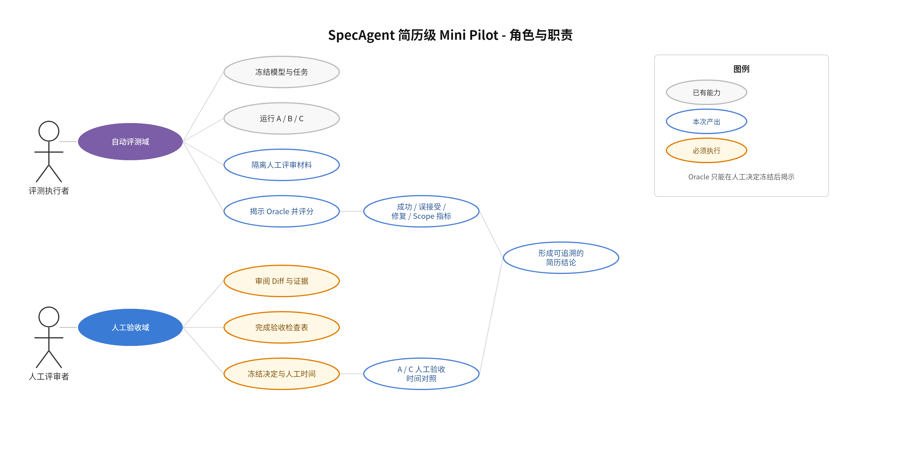

# SpecAgent 简历级 Mini Pilot 测试指南

> 目标：在约 60 分钟内，用固定模型和 3 个中高风险任务，对比普通 AI Coding（A）与 SpecAgent（C），得到可追溯、可写进简历的工程 Pilot 数据。
>
> 结论边界：这是小样本工程验证，不是统计学正式实验。报告中必须写明 `3 tasks / 1 repetition / DeepSeek-V4-pro`，不能把结果推广为所有项目和模型的普遍结论。



## 1. 这次测试回答什么

主要回答一个问题：

> 相比普通 ReAct，SpecAgent 是否通过 ChangeSpec 契约、确定性 Evidence Gate 和一次 Evidence 驱动修复，减少人工作出可信交付决定的投入，同时不降低代码正确率？

只保留四类简历相关指标：

| 指标 | 数据来源 | 说明 |
|---|---|---|
| 客观成功率 | 自动评测隐藏 Oracle + Scope | 最终候选同时通过隐藏测试和修改范围检查才算成功 |
| 错误接受率 | 人工决定 + 隐藏 Oracle | 人工选择 `ACCEPT`，但隐藏 Oracle 或 Scope 失败 |
| 人工验收投入 | 人工计时 CSV | 阅读 Spec、Diff、Evidence、测试结果和作出决定的主动时间 |
| 自动修复覆盖 | C 组评测报告 | 首轮满足修复条件后，被一次自动修复恢复为客观成功的比例 |

自动等待时间、Token 和费用作为辅助指标单列，不能算进人工投入。

## 2. 固定实验设计

### 2.1 不允许临时修改的配置

| 项目 | 固定值 |
|---|---|
| Provider | `deepseek` |
| Model | `DeepSeek-V4-pro` |
| Seed | `20260820` |
| Repetition | `1` |
| 主对照 | A 普通 ReAct → C SpecAgent（允许一次修复） |
| 辅助组 | B SpecAgent（关闭修复）；当前执行器会自动连带运行 |
| 产品运行数 | `3 tasks × 3 modes × 1 = 9` |
| 人工评审上限 | 每个 session 5 分钟主动时间 |

### 2.2 三个任务

| 任务 | 风险点 | 选择原因 |
|---|---|---|
| `feature-flag-precedence` | 多规则优先级 | 测需求约束是否被完整落实 |
| `operation-result-api-compat` | API 兼容性 | 测非目标约束和已有调用方保护 |
| `token-expiry-cross-file` | 跨文件一致性 | 测多文件修改和交付范围治理 |

这三个任务比简单字符串处理更容易暴露“代码写完但不能可信验收”的问题。不要把今天已经出现成功率天花板的简单 Smoke 结果混入本次结论。

## 3. 预计时间

| 阶段 | 预计耗时 | 是否需要人工持续操作 |
|---|---:|---|
| 冻结环境和启动评测 | 5 分钟 | 是 |
| DeepSeek 9 次产品运行 | 15～30 分钟 | 否 |
| A/C 六个计时评审 session | 约 30 分钟 | 是 |
| 揭示 Oracle、计算指标、写结论 | 10 分钟 | 是 |

总耗时预计 45～70 分钟。若两名评审者并行完成各自 3 个 session，可进一步缩短墙钟时间。

## 4. 运行前准备

### 4.1 冻结本次实验信息

在 PowerShell 中记录当前代码状态：

```powershell
git rev-parse HEAD
git status --short
```

将输出复制到本次实验备注。工作区不强制干净，但必须如实记录；如果评测框架、fixture 或模型 Client 在测试前后发生变化，本次结果不可直接合并。

确认 `.env` 中存在可用的 `DEEPSEEK_API_KEY`。命令行会显式覆盖 provider 和 model，避免误用默认 GLM。

如果评测目录或公开测试自上次预检后被修改，先运行免费预检；未修改则跳过，以节省时间：

```powershell
mvn test '-Dtest=ChangeSpecEvaluationInfrastructureTest' '-Dpaicli.changeSpecEval.validateFixtures=true' -DskipTests=false
```

### 4.2 准备记录文件

复制仓库已有模板，分别记录 session 和主动时间事件：

- `docs/change-spec-human-effort-events-template.csv`
- `docs/change-spec-human-effort-sessions-template.csv`
- `docs/change-spec-human-effort-assignments-template.csv`

本次建议使用 `study_id=resume-mini-pilot-20260826-01`，参与者只写 `P1`、`P2`，不要写姓名。

## 5. 执行自动评测

在项目根目录运行：

```powershell
mvn test -Pchange-spec-eval `
  '-Dpaicli.changeSpecEval.provider=deepseek' `
  '-Dpaicli.changeSpecEval.model=DeepSeek-V4-pro' `
  '-Dpaicli.changeSpecEval.cases=feature-flag-precedence,operation-result-api-compat,token-expiry-cross-file' `
  '-Dpaicli.changeSpecEval.repetitions=1' `
  '-Dpaicli.changeSpecEval.seed=20260820'
```

该命令调用真实模型并产生费用。正常情况下会产生 9 次产品运行，以及每个任务一次供 B/C 共用的配对 Draft。

运行结束后定位报告：

```powershell
$evalRun = Get-ChildItem 'target/change-spec-eval' -Directory |
  Sort-Object LastWriteTime -Descending |
  Select-Object -First 1

$evalRun.FullName
Get-FileHash (Join-Path $evalRun.FullName 'report.md') -Algorithm SHA256
```

记录运行目录和报告 SHA256。此时操作员可以保管 `report.md`，但人工评审完成前不要把报告或 `hidden-verification.log` 给评审者看。

## 6. 人工验收测试

### 6.1 参与者分配

推荐使用两名能阅读 Java、Maven 测试和代码 Diff 的评审者。每人不能重复看到同一个任务，避免学习效应：

| 评审者 | `feature-flag-precedence` | `operation-result-api-compat` | `token-expiry-cross-file` |
|---|---|---|---|
| P1 | A | C | A |
| P2 | C | A | C |

这样每个任务都有 A/C 对照，而且同一评审者不会重复看到相同 fixture。

只有一名评审者时，可以评审全部六个 session，但必须在报告中标记 `single-reviewer exploratory pilot`；因为同一人会重复看到任务，人工时间只能作为探索性结果。

### 6.2 评审者允许看到的材料

A 组只允许看到：

1. 原始任务描述；
2. 对应 workspace 的 `run.log`；
3. Agent 修改后的源码和公开测试；
4. 可见测试输出，例如 `target/surefire-reports`；
5. 修改文件列表或基于初始 fixture 生成的 Diff。

C 组允许看到：

1. 原始任务描述；
2. `.paicli/specs/*.md` 中锁定的 ChangeSpec；
3. `.paicli/runs/*/change.diff`；
4. `.paicli/runs/*/result.json` 中的 Criterion、Verifier Evidence、Scope 和 Verdict；
5. `run.log`、修改后的源码和公开测试输出。

两组都禁止看到：

- `hidden-verification.log`；
- 隐藏测试源码、结果或答案；
- `report.md` 中的隐藏 Oracle、客观成功和虚假完成结果；
- 另一模式对同一任务的实现。

### 6.3 单个 session 的硬流程

每个 session 最多 5 分钟主动时间：

1. 评审材料完整显示后启动计时。
2. 阅读任务、实际修改代码或 `change.diff`、公开测试结果；C 组还要阅读锁定 Spec、Evidence 与 Verdict。
3. 完成下面的检查表。
4. 选择 `ACCEPT / REJECT / REWORK / ABANDON`。
5. 立即停止计时，记录 `active_ms` 和 `decision_frozen_at_utc`。
6. 决定冻结后，操作员才能揭示隐藏 Oracle 与 Scope 结果。

必须同时满足以下三项，session 才记为 `VALID`：

```text
diff_opened=true
review_checklist_completed=true
decision_frozen_before_oracle=true
```

缺任意一项就记为 `EXCLUDED_PROTOCOL_DEVIATION`，不能用于人工提效结论。

### 6.4 验收检查表

评审者在冻结决定前逐项打勾：

- [ ] 我查看了实际修改代码或完整 `change.diff`，没有只看 Agent 的完成声明。
- [ ] 我核对了需求中的主要行为规则。
- [ ] 我查看了公开测试执行结果，而不只是“测试通过”的文字描述。
- [ ] 我检查了修改文件范围和明显的非目标变更。
- [ ] C 组：我核对了 Criterion 与 Evidence 是否对应；A 组：此项记 `N/A`。
- [ ] 我已经冻结最终决定，尚未查看隐藏 Oracle。

### 6.5 人工时间口径

本次 Mini Pilot 主要测“人工验收决策时间”：

```text
A_human_effort = result_review
C_human_effort = spec_confirmation + result_review
```

其中：

- `spec_confirmation`：阅读锁定 ChangeSpec 并确认需求、约束、验收标准的主动时间；
- `result_review`：阅读代码/Diff、测试、Evidence 并作出最终决定的主动时间；
- 模型、Maven、Verifier 和隐藏 Oracle 等待均不计入人工时间；
- 如果没有真实执行人工返工和重跑，不得声称“返工时间降低”，只能写“人工验收时间降低”。

## 7. 揭示隐藏结果并评分

所有六个决定冻结后，操作员打开 `report.md`，把每个 session 的自动结果填入 sessions CSV：

- `hidden_oracle_pass`
- `scope_pass`
- `objectively_correct`
- `false_acceptance`
- `product_total_ms`

判定公式：

```text
objectively_correct = hidden_oracle_pass AND scope_pass
false_acceptance = (final_human_decision == ACCEPT) AND NOT objectively_correct
```

只使用 `protocol_status=VALID` 的 session 计算主要结果。

### 7.1 四个最终数字

```text
A客观成功率 = A客观成功数 / A运行数
C客观成功率 = C客观成功数 / C运行数

人工验收时间降低率
= (A组人工时间中位数 - C组人工时间中位数)
  / A组人工时间中位数 × 100%

错误接受率
= false_acceptance数量 / ACCEPT数量

自动修复成功率
= C组首次失败、修复后客观成功数 / C组repair_eligible_count
```

若 `ACCEPT数量=0`，错误接受率写 `N/A`。若 `repair_eligible_count=0`，自动修复写 `NOT_EVALUABLE_NO_OPPORTUNITY`，不能写成 `0%`。

Scope 越界率使用：

```text
scope_violation_rate = scope_pass=false 的运行数 / 全部运行数
```

### 7.2 结果汇总表

| 指标 | A 普通 ReAct | C SpecAgent | A→C 变化 |
|---|---:|---:|---:|
| 客观成功率 |  |  |  pp |
| 人工验收时间中位数 |  ms |  ms |  % |
| 错误接受率 |  |  |  pp |
| Scope 越界率 |  |  |  pp |
| 产品墙钟 P50 |  s |  s |  % |
| Token / 单位成功成本 |  |  |  % |
| C 修复机会/恢复数 | N/A |  /  | N/A |

## 8. 结论门槛

只有同时满足以下条件，才能写“人工验收提效”：

1. C 客观成功率不低于 A；
2. C 人工验收时间中位数比 A 至少降低 20%；
3. C 错误接受率不高于 A；
4. C 的 Scope 越界为 0；
5. 所有纳入人工时间的 session 都满足三项有效性硬门槛。

自动修复是机会条件指标：有修复机会时如实报告恢复率；没有机会时不进入通过/失败判断。

如果 C 更慢但错误接受明显下降，结论应写“提升交付可靠性，以少量验收成本换取更低误接受风险”，不能写“提效 XX%”。

## 9. 简历表述模板

满足全部门槛时：

> 在 DeepSeek-V4-pro、3 个中高风险 Coding 任务的 A/C 对照 Pilot 中，SpecAgent 通过 ChangeSpec 契约、确定性 Evidence Gate 与自动修复，在保持客观成功率不下降和 0 Scope 越界的前提下，将人工验收决策时间降低 **XX%**，错误接受率由 **XX%** 降至 **XX%**。

存在修复机会且发生恢复时，可追加：

> 对首轮验证失败任务，Evidence 驱动修复恢复 **X/Y（XX%）**。

没有人工有效计时，但自动结果成立时：

> 构建 ChangeSpec 锁定、确定性 Verifier、Evidence 驱动修复与可追溯 Verdict 闭环，在 3 个中高风险任务 Pilot 中实现 **XX%** 客观成功率、**XX%** 虚假完成率和 **0** 次 Scope 越界；人工提效仍待扩大样本验证。

禁止使用：

- 没有有效计时却写“人工投入降低 XX%”；
- 没有修复机会却写“自动修复率 0%”或虚构覆盖率；
- 只看 Agent 完成声明就把 session 计为有效验收；
- 隐去任务数、模型和 Mini Pilot 边界；
- 把自动模型等待时间降低冒充开发者人工提效。

## 10. 当天交付物清单

- [ ] 自动评测 `report.md` 及 SHA256；
- [ ] 9 个隔离 workspace；
- [ ] 6 个 A/C 人工评审 session 记录；
- [ ] events CSV、sessions CSV、assignments CSV；
- [ ] 四项指标汇总表；
- [ ] 一条符合实际结果的简历项目描述；
- [ ] 明确记录 `3 tasks / 1 repetition / DeepSeek-V4-pro / Mini Pilot`。

更严格的真人总人时口径、正式分配和统计边界见 `docs/change-spec-human-effort-study.md`；自动评测指标定义见 `docs/change-spec-abc-evaluation.md`。

## 11. 批次执行记录与收束结论（2026-08-26）

本指南已执行两个批次，与 2026-08-23 GLM 复跑、2026-08-24 真人研究共同构成"三个格子"的证据矩阵。收束结论见 11.3。

### 11.1 批次 01：A/C 对照 + AI 评审（探索性）

- 配置：`feature-flag-precedence` / `operation-result-api-compat` / `token-expiry-cross-file`，1 repetition，DeepSeek-V4-pro，seed `20260820`。
- 记录：`change-spec-resume-mini-pilot-20260826-01-*.csv`；自动报告见对应 `target/change-spec-eval` 运行目录。
- 评审者：单一 AI 评审（GLM-5.3），墙钟含工具调用延迟；按 §6.1 规则属于 `single-reviewer exploratory pilot`，其时间不可用于人工提效结论。

| 指标 | A 普通 ReAct | C SpecAgent |
|---|---:|---:|
| 客观成功（隐藏 Oracle + Scope） | 3/3 | 3/3 |
| 错误接受 | 0/3 | 0/3 |
| 错误拒绝 | 0/3 | 1/3（S06） |

S06 是唯一非 ACCEPT 决定：C 的公开 Verdict 为 `PASSED`，但评审者核对锁定 Spec 时发现 AC-4/AC-5 契约文本自相矛盾，选择 `REWORK`；代码本身客观正确。这直接演示了契约层的双刃性——评审对象从 diff 转移到契约后，**契约自身的缺陷（而非代码缺陷）会成为被拒绝的原因**，契约质量本身需要治理。

AI 评审墙钟（仅参考，不是人工投入）：A 平均 43.5s，C 平均 51.1s（+17%，C 含阅读锁定 Spec 与 Evidence 的时间）。

### 11.2 批次 02：更难任务 × 纯自动（resume-mini-pilot-20260826-02）

动机：验证"强模型 + 更高任务复杂度"能否制造失败空间，把失败与模型驱动能力缺陷解耦。新增 3 个 HIGH_RISK fixture：

| 任务 | 制造的失败空间 |
|---|---|
| `budget-allocator` | 最大余数分配 + long 溢出陷阱 + 小数并列时索引优先级 |
| `sliding-window-limiter` | 半开滑窗边界语义 + 双方法共享时钟单调性校验 |
| `deadline-retry-runner` | 跨文件重试预算 × 截止时间交互 + 首次尝试前截止检查 |

配置：DeepSeek-V4-pro，2 repetitions，seed `20260820`，3×3×2=18 次产品运行。报告目录：`target/change-spec-eval/2026-08-26T08-26-52.907248900Z-20260820/`。

| 组 | 客观成功率 | 全运行虚假完成 | Scope 越界 | 修复机会 | 产品耗时 P50 | 平均 Token(in/out) |
|---|---:|---:|---:|---:|---:|---:|
| A · ReAct | 100% | 0% | 0% | N/A | 82.87s | 37429/3861 |
| B · Spec 无修复 | 100% | 0% | 0% | 0/6 | 208.16s | 91860/10600 |
| C · Spec 一次修复 | 100% | 0% | 0% | 0/6 | 205.52s | 76832/9929 |

解读：

1. 三个任务的全部陷阱（溢出、边界语义、跨文件交互）都被 DeepSeek 首轮做对，18/18 PASS、0 修复机会。**算法复杂度不是强模型的失败轴**：需求干净枚举时，"自述完成 ≠ 真完成"的缺口不存在，SpecAgent 没有作用空间。
2. 开销构成：B/C 相对 A 约 2.5× 墙钟、2.0～2.5× Token；Draft P50 99.64s 是大头，公开 Verifier P50 约 12～13s；ReAct 实现阶段与 A 相当（B 107.30s / C 94.04s vs A 82.87s）。契约不拖慢实现，成本集中在契约生成。
3. 报告中"惩罚 TTA +129.34% FAIL"是零失败下惩罚值退化为成功值的评分产物（A=96.59s、C=221.53s 均为成功耗时），不是有效信号。
4. RFC 分维度结论中，成功率增益与虚假完成改善因天花板/下限触及为 `NOT_EVALUABLE`，修复覆盖因无机会为 `NOT_EVALUABLE`。

### 11.3 收束：三个格子的证据矩阵

| 场景 | 数据来源 | 结果 | 证明了什么 |
|---|---|---|---|
| 弱模型 × 干净任务 | 2026-08-23 GLM 36 次复跑 | A 58.33% 成功且失败全部静默；B/C 41.67%，C 虚假完成 **0%** | Verdict 可信：C 的失败以诚实 FAIL 暴露，A 的失败伪装成完成 |
| 强模型 × 脏需求 | 2026-08-24 真人 9-session | 客观正确 A/B/C = 1/3、1/3、**2/3**；错误接受 2/3、2/3、**1/3**；平均真人总人时 167.8/270.4/250.8s | 含糊真实需求下兑现核心价值：错误接受减半、正确率翻倍，代价是毛人时 +50% |
| 强模型 × 干净任务 | 2026-08-26 批次 01+02（27 次自动运行） | 批次 01：A/C 3/3、0 错误接受；批次 02：A/B/C 100%、0 修复机会 | 无失败空间时 SpecAgent 是纯开销（约 2.5× 墙钟，集中在 Draft） |

价值定位（回答"SpecAgent 为什么产生"）：

1. 它不解决"模型解不出难题"——那是模型能力问题（GLM 批次的失败多属此类：工具调用格式、参数错误）。
2. 它解决三个验收侧的病：**自述完成不可信**（模型说 done ≠ done）、**含糊需求被模型自行拍板**（用户很晚才发现拍错）、**验收是无界审查**（读全量 diff、重新推导需求）。
3. 机制：把"审实现"（长、无结构、写码后）替换为"审意图"（短、结构化、写码前）+ 确定性证据。批次 01 的 S06 是直接证据：唯一被拒绝的交付，拒绝原因是契约文本矛盾而非代码错误——评审对象已从 diff 转移到契约。
4. 边界：spec 下人工审批触点**变多**（毛人时 +50%）。站得住的提效口径是**单位可信正确交付的人时**：真人研究 A = 167.8s ÷ 1/3 ≈ 504s/次 vs C = 250.8s ÷ 2/3 ≈ 377s/次（约 -25%，n=3，方向性证据）；A 的错误接受（2/3）产生的下游返工尚未计入。

一句话结论：

> SpecAgent 不提高模型上限，它改变失败的表达方式——把静默的虚假完成变成诚实的 FAIL + 可审计证据。存在失败空间的场景（弱模型或含糊需求）里它显著降低错误接受；不存在失败空间的场景里它是一笔明码标价的保险费（约 2.5× 墙钟，集中在 Draft 阶段）。

### 11.4 简历/面试表述（按本数据收束）

可写：

> 设计并实现 Spec-to-Evidence 交付闭环（契约锁定、确定性 Verifier、证据驱动修复、可追溯 Verdict），并用三组对照研究定位其价值边界：弱模型复跑（36 次）中 Verdict 虚假完成率 0%；真人评审研究（9 session）中错误接受率 2/3 → 1/3、客观正确率 1/3 → 2/3；强模型 + 高复杂度干净任务（两批次 27 次自动运行）中识别出成功率天花板，测得契约层固定开销约 2.5× 墙钟并完成开销分解（Draft 阶段占比约 80%）。

在 §9 禁用清单基础上追加：

- 把强模型干净任务上的 100% 归功于 SpecAgent（A 组同样 100%）；
- 用 AI 评审墙钟冒充人工验收时间；
- 用零失败批次的"惩罚 TTA"对比声称性能恶化或改善；
- 隐去"错误接受降低是以毛人时 +50% 换来的"这一交换关系。
