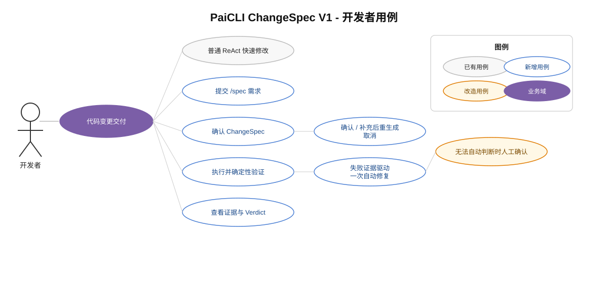

# RFC: ChangeSpec V1 — Spec-to-Evidence 闭环

> 状态：Accepted  
> 目标版本：V1  
> 实现进度：前三条垂直切片已完成（领域模型/Codec/校验/Digest；`/spec` Draft 生成与确认；锁定持久化并注入现有 ReAct）
> 核心目标：缩短从需求提出到代码被可信验收的时间，而不是增加一套需求管理流程。

## 1. 决策摘要

PaiCLI 新增显式入口：

```text
/spec <代码变更需求>
```

该入口把一次自然语言代码需求转换为用户确认的 ChangeSpec，默认交给现有 ReAct Agent 执行，然后通过确定性检查收集 Evidence、逐条生成 Criterion Result，并归约为最终 Verdict。

V1 的完整闭环是：

```text
需求 → ChangeSpec Draft → 用户确认并锁定 → ReAct 修改
    → 确定性验证 → 一次证据驱动修复 → Verdict
```

核心决策如下：

1. ChangeSpec 是按需启用的契约层，不替代普通 ReAct，也不是新的 Agent 类型。
2. V1 只接 ReAct，不同时接入 Plan 和 Team。
3. V1 必须完成执行、验证、修复和判定闭环，不能只交付 Spec 文档生成。
4. Evidence 只保存验收必需事实，不保存思维过程和完整工具日志。
5. V1 不启用 LLM Reviewer；不能确定性判断的条件进入 Human。
6. Spec 确认不等于工具授权，现有 HITL、PathGuard 和 CommandGuard 继续生效。
7. 从第一版开始记录效率、质量和成本指标；没有对照实验，不宣称提效。



## 2. 为什么现在做

PaiCLI 已有 ReAct、Plan-and-Execute 和 Multi-Agent 三条执行路径，但执行策略本身不能证明代码变更满足了用户需求。

当前评测框架已经能通过隐藏验证命令和允许修改文件集合判断结果，但这些能力只存在于测试代码中，尚未成为开发者日常使用的产品闭环。现有实验还暴露了一个直接问题：收集工具调用只能证明 Agent “做过什么”，不能证明它“做对了什么”；小样本实验中的 Multi-Agent Reviewer 仍出现误放行。详见 [Agent A/B 评测报告](agent-ab-evaluation-pilot-report-2026-08-10.md)。

ChangeSpec V1 要解决的不是代码生成能力，而是下面三段浪费：

- 开始修改后才发现需求理解不一致；
- Agent 自述完成，但关键验收没有证据；
- 人需要重新阅读需求、Diff 和测试日志才能判断结果。

## 3. 成功标准

### 3.1 核心效率指标

- `time_to_accepted_change`：从提交需求到第一次得到可信 `PASSED` 的墙钟时间；未通过的运行按实验时限截断。
- `human_intervention_time`：用户实际用于确认 Spec、处理审批和人工验收的时间，不包含等待模型和命令执行的时间。

### 3.2 质量与成本护栏

- `task_success_rate`
- `first_pass_success_rate`
- `acceptance_pass_rate`
- `scope_violation_rate`
- `false_completion_rate`
- `spec_generation_ms`
- `spec_confirmation_ms`
- `verification_ms`
- `repair_count`
- LLM 调用次数、输入/输出 Token、估算成本
- `FAILED / INCOMPLETE / NEEDS_HUMAN` 分布

### 3.3 首轮价值门槛

先做 6 个分层任务、每组至少重复 2 次的快速试验；运行稳定后扩展到 12～15 个任务、每组重复 3 次。任务必须区分小任务、中等任务和高风险任务。

对中等和高风险任务，ChangeSpec V1 只有满足以下条件才可以宣称有开发效率价值：

- 相比普通 ReAct，任务成功率至少提高 10 个百分点，或虚假完成率相对下降至少 30%；
- `time_to_accepted_change` 的 P50 不得恶化超过 15%；
- `human_intervention_time` 不得增加；
- Spec 生成与确认开销必须单独报告，不能隐藏在总耗时中。

这些是首轮产品决策门槛，不是统计学上的普遍结论。

## 4. 何时使用 ChangeSpec

V1 不强制所有任务使用 Spec，也不实现复杂的自动分类器。

普通 ReAct 更适合同时满足以下特征的任务：

- 单一且明确的目标；
- 修改局部、低风险；
- 验收方式显而易见；
- 做错后容易发现和回滚。

出现以下任一情况时，建议使用 `/spec`：

- 有多条验收条件；
- 需求存在歧义或明确的非目标；
- 跨文件或跨模块；
- 修改范围必须受控；
- 涉及兼容性、安全、公共接口或数据结构；
- 返工或人工审核成本较高。

判断重点是错误成本，而不是代码行数。V1 可以提示复杂任务考虑 `/spec`，但不得自动强制切换。

## 5. 范围

### 5.1 V1 包含

- `/spec <需求>` 命令；
- 自动生成 ChangeSpec Draft；
- 单屏摘要确认、补充后重生成、取消；
- 确认后的 Spec 文件、revision 1 和 SHA-256 digest；
- ReAct 执行；
- 修改范围检查；
- 命令和测试报告检查；
- 最终 changed files 与 diff；
- Criterion Result；
- Verdict；
- 确定性失败后最多一次自动修复；
- 紧凑运行结果和效率指标持久化；
- A/B/C 评测入口。

### 5.2 V1 不包含

- Plan 或 Team 执行；
- LLM Reviewer、Reviewer 辩论或投票；
- Preferences 排序；
- API Diff、依赖 Diff、完整静态扫描；
- 自动生成全部测试；
- GitHub Issue、PR 或企业审批平台；
- 通用需求管理和完整 Spec Kit 工作流；
- 运行中的自动 Spec Revision 流程；
- 完整工具调用日志和 Agent 思维过程。

V1 锁定 revision 1。确认前的补充只是修改 Draft；确认后如果需求本身需要改变，本次运行停止，用户重新发起 `/spec`。正式的跨 Revision 交互在闭环价值验证后再实现。

## 6. 用户交互

### 6.1 命令入口

V1 只支持带需求的命令：

```text
/spec 修复登录超时后的无限重试，最多重试三次，其他错误不重试
```

单独输入 `/spec` 时显示用法，不增加“下一条消息自动进入 Spec 模式”的隐藏状态。

### 6.2 Draft 生成

为了控制首版延迟和实现成本，V1 根据以下输入生成 Draft：

- 用户需求；
- 已加载的 Project Context；
- 用户显式引用的本地文件或目录。

V1 不为了生成 Draft 再启动一次可写 Agent。用户没有提供明确范围时，Draft 使用 `scope.mode: open`；评测任务默认由任务集提供 `bounded` 范围。

Draft 必须先通过结构校验，才能展示给用户。展示内容只包含：

- Goal；
- Non-goals；
- Scope；
- Acceptance Criteria；
- Verifiers。

用户操作：

- `Enter`：确认并锁定；
- `I`：输入补充要求并重新生成 Draft；
- `Esc`：取消，不修改代码。

用户不需要手写 YAML。完整 YAML 可以展开查看，机器事实源仍是 YAML。

### 6.3 Human Criterion

Draft Generator 应优先生成可确定性验证的 Criterion，只有产品取舍或业务语义确实无法自动判断时才使用 `oracle.type: human`。

确定性检查全部通过后，CLI 逐条展示待人工判断的 Criterion 和相关 diff：

- 通过：该 Criterion 记为 `PASS`；
- 拒绝：该 Criterion 记为 `FAIL`；
- 跳过或中断：最终 Verdict 为 `NEEDS_HUMAN`。

该交互耗时计入 `human_intervention_time`。

### 6.4 锁定与执行

确认后保存：

```text
.paicli/specs/CHANGE-<timestamp>-r1.md
```

系统计算：

```text
specId + revision + sha256(canonical machine model)
```

Markdown 说明不进入 digest，也不能覆盖 YAML 中的机器契约。

锁定后的 YAML 与原始需求一起注入 ReAct 本轮输入。ChangeSpec 不规定 Agent 的具体工具顺序和代码实现方式。

## 7. ChangeSpec V1 格式

```markdown
---
schema: paicli/change-spec/v1
id: CHANGE-20260819-001
revision: 1
title: 修复登录超时后的无限重试

intent:
  goal: 超时错误最多重试三次，其他错误不重试
  non_goals:
    - 不调整登录接口
    - 不更换 HTTP Client

scope:
  mode: bounded
  include:
    - src/main/java/auth/**
    - src/test/java/auth/**
  exclude:
    - pom.xml

acceptance:
  - id: AC-1
    kind: behavior
    statement: 超时错误最多重试三次
    oracle:
      type: deterministic
      verifiers: [VT-TEST]

  - id: AC-2
    kind: behavior
    statement: 非超时错误不得重试
    oracle:
      type: deterministic
      verifiers: [VT-TEST]

  - id: AC-3
    kind: scope
    statement: 修改不得超出允许范围
    oracle:
      type: deterministic
      verifiers: [VT-SCOPE]

verifiers:
  - id: VT-SCOPE
    type: path_scope

  - id: VT-TEST
    type: command
    command: mvn -q -DskipTests=false test
    expect:
      exit_code: 0
      junit_report_glob: target/surefire-reports/TEST-*.xml
      minimum_tests: 1
---

# 背景

生产环境中，登录请求超时后会进入无限重试。
```

### 7.1 必填规则

- `schema`、`id`、`revision`、`title` 必填；
- `intent.goal` 必填，`non_goals` 可以为空；
- `scope.mode` 只能是 `open` 或 `bounded`；
- `bounded` 必须有非空 `include`；
- 所有路径必须是项目相对路径，禁止 `..` 和绝对路径；
- `acceptance` 至少一条，ID 唯一且 statement 非空；
- V1 的 `kind` 支持 `behavior`、`scope`、`compatibility`、`quality`、`safety`、`performance`；
- V1 的 `oracle.type` 只支持 `deterministic` 和 `human`；
- deterministic Criterion 必须引用至少一个存在的 Verifier；
- V1 的 Verifier 只支持 `path_scope` 和 `command`；
- 配置 `minimum_tests` 时必须同时配置 `junit_report_glob`，避免猜测构建工具输出格式。

### 7.2 Scope 语义

- `bounded`：最终变化只能命中 `include`，且不能命中 `exclude`；
- `open`：最终变化不要求命中 `include`，但仍不能命中 `exclude`；
- glob 使用项目相对路径和 `/` 分隔符；
- 运行开始前已存在的脏文件作为 baseline，不算本次 Agent 新增变化；
- `.paicli/specs` 和 `.paicli/runs` 属于运行产物，不参与代码 Scope 判断。

## 8. Evidence 与验证

### 8.1 最小 Evidence

V1 只采集：

- `specId`、`revision`、`specDigest`；
- baseline 与最终 workspace 的 changed files；
- 最终 diff；
- 每个 Verifier 的输入、状态和必要输出摘要；
- 命令退出码、超时状态；
- JUnit XML 中的测试数量、失败数和错误数；
- HITL 或策略拒绝导致的执行中断；
- Human Criterion 的确认结果；
- 各阶段耗时和 LLM 使用量。

不采集：

- 思维过程；
- “我已经完成”等 Agent 自述；
- 全量 read/grep 工具历史；
- 与 Acceptance 无关的终端日志。

### 8.2 Verifier Result

Verifier 返回：

- `PASS`：正常执行且满足预期；
- `FAIL`：正常执行但不满足预期；
- `ERROR`：未获得有效结果，例如命令不存在、超时或进程异常。

命令退出码非预期属于 `FAIL`。命令成功但 `minimum_tests` 未满足也属于 `FAIL`。命令无法启动或超时属于 `ERROR`。

### 8.3 Criterion Result

每条 Acceptance Criterion 返回：

```text
criterionId
status: PASS | FAIL | INCONCLUSIVE | NOT_RUN
evidenceIds
judge: verifier | human
reason
```

Agent 的最终自然语言回答不能生成 PASS。

### 8.4 Verdict 归约

按以下固定优先级归约：

1. Spec 结构无效 → `SPEC_INVALID`
2. 任一 Criterion 为 `FAIL` → `FAILED`
3. 必要 Verifier 为 `ERROR`、`NOT_RUN` 或证据缺失 → `INCOMPLETE`
4. 存在未完成人工判断的 Criterion → `NEEDS_HUMAN`
5. 所有 Criterion 为 `PASS` → `PASSED`

`FAILED` 表示已有有效证据证明代码不符合要求；`INCOMPLETE` 表示没有得到足够证据，不能把环境或流程故障算成代码失败。

## 9. 一次证据驱动修复

首次验证出现 deterministic `FAIL` 时，系统向同一个 ReAct 会话追加一条结构化修复输入，只包含：

- 未通过的 Criterion；
- 对应 Evidence；
- 失败原因；
- 原 ChangeSpec digest；
- 禁止修改锁定 Spec 的提示。

Agent 最多修复一次，之后重新执行全部 Verifier，而不是只重跑失败项。

以下情况不自动修复：

- `SPEC_INVALID`；
- Verifier `ERROR`；
- HITL 或策略拒绝；
- Human Criterion 尚未判断；
- 需求本身需要改变。

## 10. 与现有 PaiCLI 的接入设计

### 10.1 入口关系

| 入口 | 契约层 | 执行策略 |
|---|---|---|
| 普通输入 | 无 ChangeSpec | ReAct |
| `/plan` | 无 ChangeSpec | Plan-and-Execute |
| `/team` | 无 ChangeSpec | Multi-Agent |
| `/spec <需求>` | ChangeSpec + Evidence Gate | ReAct |

ChangeSpec 与执行策略在概念上正交，但 V1 不实现 `/spec --mode plan/team`。

### 10.2 最小模块

新增 `com.paicli.spec`，对 CLI 暴露一个主要接口：

```java
SpecRunResult run(String request)
```

建议文件保持在以下规模，不建立通用工作流引擎：

```text
spec/
├── ChangeSpec.java          # 不可变领域数据及枚举
├── ChangeSpecCodec.java     # YAML/Markdown 解析、校验、规范化和 digest
├── SpecDraftGenerator.java  # 单次 LLM Draft 生成
├── SpecRunCoordinator.java  # 确认、ReAct、验证、一次修复、结果持久化
├── WorkspaceChangeTracker.java # baseline、changed files、diff
└── SpecRunResult.java       # Evidence、Criterion Result、Verdict、指标
```

`Main` 只负责解析 `/spec`、展开 mention、调用 Coordinator 和渲染结果。Verifier 分派先作为 `SpecRunCoordinator` 的内部实现；V1 不创建插件系统或公共 Verifier SPI。

`ChangeSpecCodec` 使用成熟 YAML 库完成嵌套结构解析和严格字段映射；不复用现有 Skill front matter 的手写 YAML 子集解析器。PaiCLI 已使用 Jackson，实施时优先采用对应的 YAML 数据格式模块，避免再维护一套解析规则。

### 10.3 复用与边界

- 复用现有 `Agent.run()`，不创建 Spec 专用 Coding Agent；
- 复用现有 `LlmClient`、Project Context、ToolRegistry、HITL 和 Renderer；
- 复用 Side-Git 做恢复，但 Evidence 的 baseline/diff 由 `WorkspaceChangeTracker` 明确采集；
- 将测试目录中的 workspace hash/changed-files 逻辑提取为生产和评测共用实现，避免两套判定口径；
- Spec 作为本轮不可变输入注入，不进入长期 Project Context；
- 工具执行仍经过 `HitlToolRegistry → ToolRegistry → PathGuard/CommandGuard`；
- Spec 的路径范围是验收条件，不是安全授权，也不能扩大 PathGuard 权限。

### 10.4 持久化

每次运行只保存两个紧凑产物：

```text
.paicli/runs/<run-id>/result.json
.paicli/runs/<run-id>/change.diff
```

`result.json` 保存 Spec 标识、Verifier Result、Criterion Result、Verdict、changed files 和指标。命令输出只保留与失败定位有关的截断摘要，不持久化完整工具日志。

## 11. 失败处理

| 场景 | 处理 |
|---|---|
| Draft 无法解析 | 展示结构错误，不进入执行 |
| 用户取消确认 | 不保存锁定 Spec，不修改代码 |
| Scope 越界 | Criterion FAIL，可触发一次修复 |
| 测试断言失败 | Criterion FAIL，可触发一次修复 |
| 测试命令不存在或超时 | Verifier ERROR，最终 INCOMPLETE |
| 测试命令成功但没有足够测试报告 | Verifier FAIL |
| HITL/策略拒绝关键操作 | 停止运行，最终 INCOMPLETE |
| Human Criterion 未判断 | NEEDS_HUMAN |
| Agent 声称完成但无证据 | 不影响 Criterion Result |

## 12. 评测设计

同一模型、同一初始仓库和同一任务分别运行：

| 组 | 输入与机制 |
|---|---|
| A | 普通自然语言 Prompt + ReAct |
| B | ChangeSpec + ReAct，不启用 Evidence Gate 修复 |
| C | ChangeSpec + ReAct + Evidence Gate + 一次修复 |

统一以下条件：

- 初始 workspace；
- 模型和采样参数；
- 时间限制和最大 Agent 轮数；
- 隐藏测试；
- 允许修改范围；
- 最终验证命令；
- 结果采集方式。

生产中的 ChangeSpec 与评测最终 Oracle 必须分离：Agent 可以看到 ChangeSpec 和公开 Verifier，但不能看到隐藏测试内容。隐藏 Oracle 只用于判断系统是否误放行。

## 13. 实现顺序

按垂直切片推进：

1. ✅ ChangeSpec 数据模型、Codec、校验和 digest；
2. ✅ `/spec` 解析、Draft 生成和确认；
3. ✅ 锁定 Spec 注入现有 ReAct；
4. Workspace baseline、Scope 和 command/JUnit 验证；
5. Criterion Result、Verdict 和紧凑持久化；
6. 一次证据驱动修复；
7. A/B/C 评测与指标报告。

每一步都为同一条端到端链路服务，不先建设 Reviewer、通用 Verifier 平台或多执行模式。

## 14. V1 完成定义

V1 工程上完成需要同时满足：

- `/spec <需求>` 可以从 Draft 走到最终 Verdict；
- 未确认或无效 Spec 不会修改代码；
- 锁定后的 digest 在执行、Evidence 和结果文件中一致；
- 越界修改和测试失败不能被 Agent 自述覆盖；
- Verifier ERROR 不会被记为代码失败；
- deterministic FAIL 最多触发一次修复，之后必然终止；
- 普通 ReAct、`/plan`、`/team` 行为不变；
- 至少完成快速 A/B/C 试验并输出核心效率指标。

达到工程完成不等于已经证明提效。是否继续接入 Reviewer、Plan 或 Team，只由评测数据决定。
