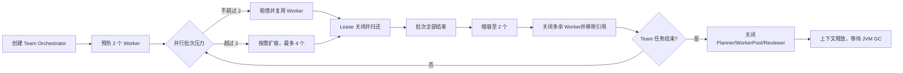
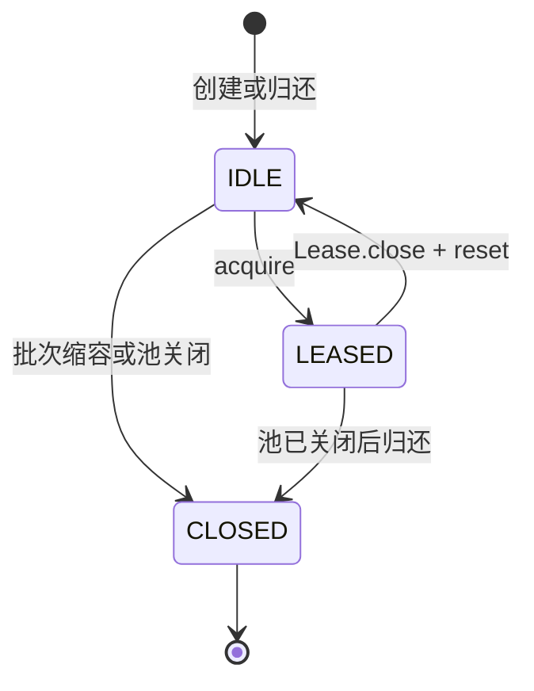

# Multi-Agent 动态生命周期管理 MVP 开发计划

> 状态：已实现；定向测试与 TUI smoke 已通过，Quick 存在 11 个无关既有失败  
> 编写日期：2026-08-12  
> 适用范围：`/team` Multi-Agent 执行路径  
> 目标版本：在不引入分布式调度和独立进程的前提下，补齐单 JVM 内 Agent 动态创建、复用、缩容销毁和任务结束回收闭环。

## 1. 背景

当前 `AgentOrchestrator` 在构造时固定创建 1 个 Planner、2 个 Worker 和 1 个 Reviewer。
并行批次使用临时 `BlockingQueue` 分配固定 Worker，并为每个并行步骤创建独立 Reviewer。
现有实现已经具备角色上下文隔离、Worker 独占使用和任务后历史清理，但生命周期管理仍有以下边界：

- Worker 数量固定为 2，不能根据同一依赖批次的并行压力动态扩容。
- `AgentOrchestrator` 和 `SubAgent` 没有显式关闭协议。
- 临时 Reviewer 在步骤完成后只失去局部引用，没有执行统一的上下文清理和关闭动作。
- CLI/TUI 创建的 Team Orchestrator 没有通过 `try-with-resources` 保证异常、取消路径的确定性回收。
- `executor.shutdownNow()` 只关闭批次线程池，不等于销毁 Agent。

本次改动将生命周期管理定义为业务资源生命周期，而不是手动释放 JVM 堆内存：Agent 关闭时清空任务上下文、从池中移除强引用、禁止再次执行，最终内存仍由 JVM GC 回收。

## 2. 目标

1. 为 Worker 建立单个 `AgentOrchestrator` 私有的生命周期池。
2. 每次 Team 任务预热 2 个 Worker。
3. 当同一依赖批次的并行压力超过空闲容量时，按需扩容，最多创建 4 个 Worker。
4. 每个步骤通过独占 Lease 使用 Worker，保证同一 Worker 不会被多个步骤并发占用。
5. Worker 归还前清理任务对话历史，只保留可复用时需要的系统上下文。
6. 一个并行批次全部结束后，将池从峰值容量动态缩容至 2 个，并显式关闭被移除的 Worker。
7. Team 任务结束时关闭 Planner、Worker 池和 Reviewer；关闭后拒绝再次执行。
8. 并行步骤的临时 Reviewer 按步骤创建、按步骤关闭，保持审查上下文隔离。
9. 保持现有 DAG 调度、Reviewer 反馈重试、并行输出顺序和共享基础设施行为不变。

## 3. 非目标

- 不实现跨 JVM、跨进程或跨节点 Agent 调度。
- 不实现容器/VM 沙箱，也不为每个 Agent 创建独立文件系统。
- 不实现基于时间的后台空闲回收线程；缩容发生在并行批次边界。
- 不实现长期驻留的全局 Worker 池；WorkerPool 只属于单次 Team Orchestrator。
- 不关闭共享的 `LlmClient`、`ToolRegistry`、`MemoryManager`、MCP Server 或 SnapshotService。
- 不改变 Reviewer 最大重试次数和当前超过重试上限后的业务语义。
- 不把 Planner 和 Reviewer 纳入 WorkerPool。

## 4. 生命周期定义

### 4.1 “动态销毁”的工程语义

本项目中的动态销毁需要同时满足：

1. Agent 执行显式 `close()`，清理独占的 `conversationHistory` 等任务级状态。
2. Agent 从 WorkerPool 的空闲队列和实例集合中移除，不再保留池级强引用。
3. 已关闭 Agent 不能再次接收任务。
4. 动态缩容由运行时负载触发：并行批次可从 2 个扩容到 4 个，批次结束后缩回 2 个。
5. Java 对象占用的堆内存由 JVM GC 最终回收，不宣称手动释放 JVM 内存。

### 4.2 生命周期流程



### 4.3 Agent 状态



## 5. 设计方案

### 5.1 SubAgent 显式关闭协议

`SubAgent` 实现 `AutoCloseable`，新增幂等关闭状态：

```java
public class SubAgent implements AutoCloseable {
    private final AtomicBoolean closed = new AtomicBoolean();

    public boolean isClosed();

    @Override
    public void close();
}
```

行为约束：

- `close()` 可重复调用，不重复释放或抛出异常。
- `close()` 清空完整 `conversationHistory`，不保留 system message。
- `execute()`、`executeWithContext()`、`review()` 在关闭后明确拒绝调用。
- `clearHistory()` 仍服务于池内复用：清空任务历史，但保留 system message。
- `SubAgent.close()` 不关闭共享 `LlmClient` 和 `ToolRegistry`。

### 5.2 WorkerPool

新增包级私有 `WorkerPool implements AutoCloseable`，负责 Worker 的创建、独占租借、归还、批次缩容和关闭。

建议接口：

```java
final class WorkerPool implements AutoCloseable {
    WorkerPool(int minWorkers, int maxWorkers, IntFunction<SubAgent> workerFactory);

    Lease acquire() throws InterruptedException;
    void trimToMinimum();
    int maxWorkers();
    Stats stats();
    void forEachWorker(Consumer<SubAgent> action);

    @Override
    public void close();
}
```

核心策略：

- `minWorkers = 2`，构造时预热。
- `maxWorkers = 4`，没有空闲 Worker 且未达到上限时按需创建。
- 达到上限后，`acquire()` 等待 Lease 归还。
- `Lease.close()` 幂等执行：先 `clearHistory()`，再归还；清理失败则关闭并移除该 Worker。
- `trimToMinimum()` 只在批次所有 Future 完成、所有 Lease 已归还后调用，关闭多余空闲 Worker，直到池容量恢复为 2。
- `WorkerPool.close()` 关闭所有空闲 Worker并唤醒等待者。
- 池关闭时仍被租借的 Worker不做并发关闭；它在 Lease 归还时关闭并移出池。

### 5.3 Lease 独占协议

`WorkerPool.Lease implements AutoCloseable`：

```java
try (WorkerPool.Lease lease = workerPool.acquire()) {
    runStep(step, lease.worker(), reviewer, context, out);
}
```

Lease 保证：

- 一个 Worker 同一时刻最多属于一个有效 Lease。
- Lease 重复关闭不会重复归还 Worker。
- Lease 关闭后调用 `worker()` 明确失败。
- 正常、异常、取消和线程中断路径都会归还或关闭 Worker。

### 5.4 AgentOrchestrator 集成

`AgentOrchestrator implements AutoCloseable`：

- 用 `WorkerPool` 替换固定的 `List<SubAgent> workers`。
- 单步骤路径和并行批次统一通过 Lease 获取 Worker。
- 并行线程数改为 `min(batch.size(), workerPool.maxWorkers())`。
- 每个并行步骤使用 `try-with-resources` 创建和关闭独立 Reviewer。
- 并行批次等待所有 Future 完成后，在 `finally` 中关闭 ExecutorService。
- 批次正常收敛后调用 `workerPool.trimToMinimum()`。
- 动态创建的 Worker必须注入当前 external context、SkillRegistry 和 SkillContextBuffer。
- `close()` 依次关闭 Planner、WorkerPool 和串行 Reviewer，并保持幂等。
- `run()` 在 Orchestrator 关闭后明确拒绝执行。

### 5.5 CLI/TUI 调用方

CLI 与 TUI 当前都是每次 Team 任务创建新的 Orchestrator，改为：

```java
try (AgentOrchestrator orchestrator = createTeamAgent(...)) {
    orchestrator.setExternalContextSupplier(...);
    orchestrator.setSkillSystem(...);
    return orchestrator.run(taskInput);
}
```

这样可以覆盖：

- 正常完成；
- Planner/Worker/Reviewer 异常；
- 用户 ESC 取消；
- 调度线程中断；
- 运行时未捕获异常。

## 6. 并发不变量

实现与测试必须共同保证：

1. `minWorkers <= createdWorkers <= maxWorkers`，池关闭后的回收阶段除外。
2. 一个 Worker 只能处于空闲队列、有效 Lease 或 CLOSED 三种互斥状态之一。
3. 同一个 Worker 不会被两个 Lease 同时持有。
4. Worker 必须在上下文清理成功后才能重新进入空闲队列。
5. `trimToMinimum()` 不关闭正在执行的 Worker。
6. 池关闭后不能创建或租借新 Worker。
7. 池关闭前已租出的 Worker 在归还时关闭，不重新入队。
8. `Lease.close()`、`WorkerPool.close()`、`SubAgent.close()` 和 `AgentOrchestrator.close()` 都必须幂等。
9. WorkerPool 只关闭自己创建的 SubAgent，不关闭共享基础设施。

## 7. 文件范围

### 7.1 新增

| 文件 | 作用 |
|---|---|
| `src/main/java/com/paicli/agent/WorkerPool.java` | Worker 生命周期池、Lease、动态扩缩容和统计 |
| `src/test/java/com/paicli/agent/WorkerPoolTest.java` | 并发独占、扩缩容、关闭和异常路径测试 |

### 7.2 修改

| 文件 | 计划改动 |
|---|---|
| `src/main/java/com/paicli/agent/SubAgent.java` | 实现显式关闭、关闭状态检查和上下文释放 |
| `src/main/java/com/paicli/agent/AgentOrchestrator.java` | 接入 WorkerPool、Lease、动态缩容和统一关闭 |
| `src/main/java/com/paicli/cli/Main.java` | Team 路径使用 try-with-resources |
| `src/main/java/com/paicli/tui/TuiSessionController.java` | TUI Team 路径使用 try-with-resources |
| `src/test/java/com/paicli/agent/SubAgentTest.java` | 补充关闭幂等及关闭后拒绝执行测试 |
| `src/test/java/com/paicli/agent/AgentOrchestratorTest.java` | 补充动态扩容、批次缩容和任务结束回收测试 |
| `README.md` | 更新 Multi-Agent 已交付能力说明 |
| `AGENTS.md` | 更新项目快照和修改约束下的真实行为说明 |
| `docs/agents-reference.md` | 记录生命周期协议、所有权与并发边界 |

### 7.3 不修改

- Reviewer 审批协议与重试上限。
- `ToolRegistry`、HITL、Memory、MCP 和 Snapshot 的所有权。
- Planner 输出 JSON 格式和 DAG 可执行步骤判断。
- ReAct 和 Plan-and-Execute 两条执行路径。

## 8. 实施步骤

1. 从历史备份中只提取 WorkerPool/Lease 的可复用设计，不直接应用包含其他实验行为的完整补丁。
2. 为 `SubAgent` 增加幂等关闭协议及关闭后调用保护。
3. 实现 `WorkerPool` 的预热、按需扩容、阻塞租借、幂等归还、批次缩容和关闭。
4. 先完成 `WorkerPoolTest`，验证并发不变量。
5. 将 `AgentOrchestrator` 的固定 Worker 列表替换为 WorkerPool。
6. 将串行和并行执行路径统一改为 Lease 使用方式。
7. 给并行临时 Reviewer 和 Orchestrator 本身补齐 try-with-resources/close。
8. 修改 CLI/TUI Team 入口，保证任务级确定性关闭。
9. 扩展 SubAgent 和 Orchestrator 测试。
10. 同步 README、AGENTS 和 agents-reference。
11. 运行定向测试、TUI smoke 和常规 quick 回归。

## 9. 测试计划

### 9.1 WorkerPool 单元测试

- 构造后恰好预热 2 个 Worker。
- 4 个并发租借按需创建 4 个不同 Worker。
- 第 5 个租借在达到上限后等待已有 Lease 归还。
- 同一个 Worker 不会被两个 Lease 同时获取。
- Lease 关闭后 Worker 可以复用，且任务历史已清理。
- Lease 重复关闭不会重复归还。
- 一个批次结束后 `trimToMinimum()` 将容量从 4 缩回 2。
- 缩容的 Worker 已关闭，且无法再次执行。
- Pool 关闭后 `acquire()` 明确失败。
- Pool 关闭期间仍在执行的 Worker 在归还时关闭。
- Worker 清理历史异常时，从池中移除并关闭，不再复用。

### 9.2 SubAgent 测试

- `close()` 清空完整上下文。
- `close()` 可重复调用。
- 关闭后的 `execute()`、`executeWithContext()` 和 `review()` 拒绝执行。
- `clearHistory()` 与 `close()` 语义不同：前者保留 system message，后者完全释放。

### 9.3 AgentOrchestrator 测试

- 原有 Planner → Worker → Reviewer 流程不回归。
- 原有 Reviewer 拒绝反馈和最多 2 次重试不回归。
- 4 个独立步骤的批次能够扩容到 4 个并发 Worker。
- 批次结束后 Worker 数量缩回 2。
- 动态 Worker 获得与预热 Worker 一致的 external context 和 Skill 配置。
- 并行 Reviewer 仍保持步骤级上下文隔离。
- Orchestrator 关闭后不能再次运行。
- 正常、异常和取消路径最终都关闭 WorkerPool。
- 最终输出仍按 step_id 稳定排序。

### 9.4 验证命令

```bash
mvn test -Dtest=WorkerPoolTest,SubAgentTest,AgentRoleTest,AgentMessageTest,AgentOrchestratorTest -DskipTests=false
mvn test -Pphase16-smoke
mvn test -Pquick
```

如果 quick 回归存在与本改动无关的既有失败，需要单独记录失败类、失败原因和与本次改动的关系，不把失败包装为通过。

## 10. 验收标准

满足以下条件后，才可以把该能力标记为已交付：

- [x] WorkerPool 默认容量为 2、最大容量为 4。
- [x] 运行时并行压力可以触发 2 → 4 动态扩容。
- [x] 并行批次结束可以触发 4 → 2 动态缩容。
- [x] 被缩容的 Worker 执行 `close()`、清空上下文并从池中移除。
- [x] Team 任务结束会关闭全部剩余 SubAgent。
- [x] Agent 关闭后无法再次执行任务。
- [x] 正常、异常、取消、中断路径均通过 Lease/try-with-resources 释放 Worker。
- [x] 同一 Worker 不会被并发复用。
- [x] 共享 LLM、工具、Memory、MCP 不被误关闭。
- [x] Multi-Agent 定向测试全部通过（40 tests）。
- [x] TUI smoke 不因 try-with-resources 改造而回归（105 tests）。
- [x] README、AGENTS、agents-reference 与实际代码一致。

## 11. 风险与控制

| 风险 | 影响 | 控制措施 |
|---|---|---|
| Worker 在执行中被并发关闭 | 对话历史竞争、执行异常 | 只关闭空闲 Worker；忙 Worker 在 Lease 归还时处理 |
| Lease 未归还 | 池容量耗尽、后续任务阻塞 | 所有租借统一使用 try-with-resources |
| 扩缩容频繁抖动 | 重复构造 SubAgent | 只在完整并行批次结束后缩容，不在单个步骤归还时缩容 |
| 动态 Worker 缺少配置 | Prompt/Skill/MCP 上下文不一致 | 所有 Worker 统一由 Orchestrator 工厂创建并配置 |
| 误关闭共享资源 | 影响 ReAct/Plan 后续任务 | 明确所有权，SubAgent 只清理自身状态 |
| CLI 取消路径提前返回 | Orchestrator 未关闭 | Team Callable 内使用 try-with-resources |
| 历史实验补丁夹带无关行为 | 改变 Reviewer 或工具语义 | 不直接应用完整补丁，只提取生命周期相关代码 |

## 12. 回滚方案

本改动不涉及数据迁移和外部协议，回滚边界清晰：

1. 将 `AgentOrchestrator` 恢复为固定 `List<SubAgent>` 和临时 `BlockingQueue`。
2. 移除 CLI/TUI Team 路径的 Orchestrator try-with-resources。
3. 保留 `SubAgent.close()` 不会影响旧调用；如需完全回滚可一并移除。
4. 删除 `WorkerPool.java` 和对应测试。
5. 回滚行为文档。

## 13. 简历与面试表述边界

完成全部验收项后，可以表述为：

> 编写 AgentOrchestrator 统一管理 Agent 生命周期：基于 WorkerPool 与 Lease 实现 Worker 独占租借，支持按并行负载从 2 个动态扩容至 4 个，并在批次结束后缩容销毁多余 Worker；通过 AutoCloseable、try-with-resources 和独立 conversationHistory 实现任务结束回收与上下文隔离。

面试中需要主动说明：

- “销毁”是关闭 Agent、清理上下文、从池中移除强引用并禁止复用，堆内存由 JVM GC 回收。
- 这是单 JVM、单次 Team 任务范围内的轻量生命周期池，不是分布式弹性调度平台。
- Worker 共享 LLM 和 ToolRegistry，但不共享对话历史；共享基础设施不由 Worker 关闭。

不能描述为：

- Kubernetes/容器级 Agent 动态调度。
- 跨节点弹性伸缩。
- 每个 Agent 拥有独立进程、网络连接或文件系统沙箱。
- 手动释放 JVM 对象内存。

## 14. 预计工作量

| 工作项 | 预计规模 |
|---|---|
| WorkerPool + Lease | 约 180–220 行生产代码 |
| SubAgent 生命周期协议 | 约 20–35 行生产代码 |
| Orchestrator/CLI/TUI 集成 | 约 80–130 行改动 |
| 单元与并发测试 | 约 220–320 行测试代码 |
| 文档同步 | 3 个现有文档局部修改 |

历史备份可以复用 WorkerPool 的基本锁、Condition 和 Lease 设计，但动态批次缩容、SubAgent 显式关闭和当前代码适配仍需重新实现与验证。整体属于低到中等风险的局部架构增强。

## 15. 实施结果

本计划已完成实现：WorkerPool 预热 2 个 Worker，同一并行批次可按压力扩容至 4 个，
批次结束后通过 `trimToMinimum()` 缩容回 2 个；如果批次等待被中断、Worker 尚未归还，
缩容请求会在后续 Lease 归还时继续生效。SubAgent 和 AgentOrchestrator 均具备幂等关闭协议，
CLI/TUI Team 入口以及并行 Reviewer 使用 try-with-resources 确定性释放任务上下文。

验证结果：

- Multi-Agent 定向测试：40 个通过，0 失败。
- TUI smoke：105 个通过，0 失败。
- Quick：运行 751 个，11 个失败、1 个跳过；失败集中在图片 file URI、Memory/RAG、Prompt、
  Inline 换行、代码搜索编码和 Markdown 表格宽度，与本次生命周期改动文件无关；Quick 中
  `WorkerPoolTest`、`SubAgentTest`、`AgentOrchestratorTest` 均通过。
