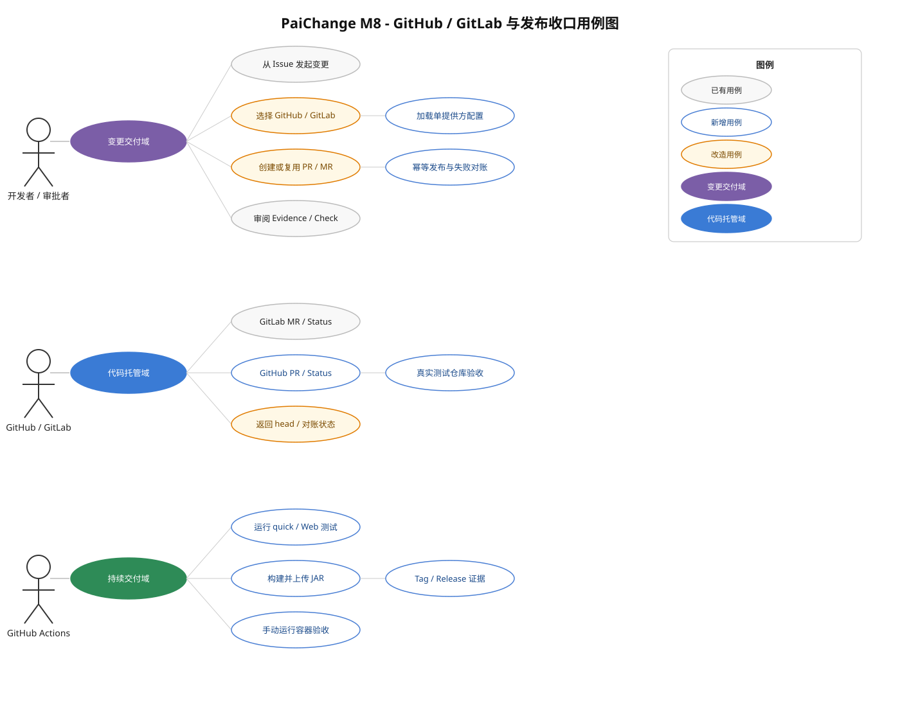

# PaiChange M8：GitHub / GitLab 与简历发布收口计划

> 状态：本地实现完成，真实 SCM 与托管 Release 待验收
> 目标：完成简历和面试演示所必需的最后一段产品闭环  
> 当前基线：PaiCLI 主 Agent 能力与 PaiChange M1–M7b 本地闭环已经完成；GitLab Adapter 已通过假服务测试但尚未连接真实实例，GitHub Adapter 与公开 CI 尚未实现  
> 原则：复用现有 Workflow、RBAC、OIDC、Evidence、存储和 Worker seam，不以“发布收口”为名重写业务工作流

## 1. 产品方向与本期完成定义

PaiCLI 是能理解代码、调用工具并修改仓库的 Java Coding Agent；PaiChange 是其上的受控变更交付层，把 Issue、ChangeSpec、Worker、Verifier、Evidence、人工审批和 PR/MR 发布连接成可审计闭环。本期不继续横向堆功能，只补齐外部代码托管与公开交付证据。

M8 完成后，项目应能诚实演示并声明：

1. 同一套 ChangeWorkflow 可以从 GitHub Issue 或 GitLab Issue 导入任务。
2. Worker 只向服务端配置的目标仓库和任务分支推送，并创建或复用 PR/MR。
3. Check/Status 始终绑定已验证的 head SHA；远端超时、重复投递或本地落账失败不会重复创建 PR/MR，也不会误标 `COMPLETED`。
4. GitHub 与 GitLab 各有一次真实测试仓库闭环证据，本地离线 Mock 继续可用。
5. 公开 CI 能在每次 push/PR 上运行确定性回归、构建可执行 JAR，并在版本 Tag 上生成可下载且带校验和的发布物。

## 2. 必须范围与明确非目标

### 2.1 必须完成

- GitHub Issue、branch、Pull Request、Commit Status/Check 的最小 Adapter。
- `PAICHANGE_SCM=mock|gitlab|github` 的单提供方服务端配置与启动校验。
- GitHub 假 HTTP 服务 + 临时 bare remote 的确定性端到端测试。
- GitHub、GitLab 各一次真实测试仓库验收。
- GitHub Actions 的 quick、Web、package、容器手动验收和 Tag release。
- README 首屏、架构图、五分钟演示、真实 PR/MR 证据链接和版本 Tag。
- 当前 M3–M7b 工作区变更完成审查、分组提交，仓库恢复为干净状态。

### 2.2 本期不做

- 登录页、Session、Refresh Token、SCIM、组织同步或多 IdP。
- Jira、多 SCM 同时启用、Webhook 驱动、自动合并或复杂发布编排。
- HA、Kubernetes、多区域、生产灾备认证或容量 SLO。
- JDT LS/rust-analyzer/pyright/gopls 完整接入、MCP OAuth/sampling、微信媒体链路。
- 付费模型批量评测或以本期结果宣称 ChangeSpec 已量化提效。

这些能力可以作为未来方向写入面试讨论，但不是简历发布版本的阻塞条件。

## 3. 当前差距

| 能力 | 当前事实 | M8 退出状态 |
|---|---|---|
| GitLab | `GitLabWorkItemAdapter` / `GitLabScmAdapter` 已完成，假 GitLab 与真实临时 Git push 已通过 | 在专用真实项目完成 Issue → branch → MR → status 闭环 |
| GitHub | 尚无 GitHub Adapter | 与 GitLab 对等的最小 Issue → branch → PR → status 闭环 |
| SCM 装配 | `ChangePlatform` 生产路径当前硬性要求 GitLab | 支持 mock/gitlab/github 单选，默认仍为 mock |
| CI | 当前没有 `.github/workflows` | PR/push 自动回归，Tag 自动构建发布物 |
| 发布物 | Maven 可生成 shaded JAR，但没有版本发布流水线 | Release 附带 JAR、SHA-256、变更摘要和验证结果 |
| 演示证据 | 离线 demo 与本地容器证据完整 | README 能在五分钟内复现；真实 GitHub/GitLab 链接可核验 |

## 4. 角色与用例



- **开发者/审批者**：从 Issue 发起变更、选择当前部署配置的代码托管平台、审阅 Evidence 和 PR/MR Check。
- **GitHub/GitLab**：保存分支、PR/MR 和 commit status，并提供远端 head 供平台对账。
- **GitHub Actions**：对代码提交执行确定性回归、构建发布物；真实 SCM 写入验收只允许手动触发。

## 5. Module 与 seam 设计

### 5.1 保持现有深 module

- `DefaultChangeWorkflow` 继续唯一决定发布资格、conclusion 和 `COMPLETED`；SCM Adapter 不自行改变业务状态。
- `ScmAdapter` 继续承担 publication identity、发布、查询、历史和只读健康检查。
- `WorkItemAdapter` 继续把外部 Issue 映射为 ChangeTask；浏览器和公共 Change API 不接收 Token、owner/repo、base ref 或本地 checkout。
- `ScmPublicationLedger` 继续保存本地发布身份；PostgreSQL/SQLite 逻辑不按 GitHub/GitLab 分叉。

新增 GitHub Adapter 后，`ScmAdapter` 和 `WorkItemAdapter` seam 将同时拥有 Mock、GitLab、GitHub 三组实现。测试通过同一 interface 观察结果，不为测试暴露 GitHub 内部 HTTP 细节。

### 5.2 集中装配，不扩散 provider 条件

在 `ChangePlatform` 装配处引入一个内部 `ConfiguredScm` module，一次返回匹配的 `ScmAdapter`、`WorkItemAdapter` 和稳定 provider 名称。它隐藏配置解析和 adapter 配对，避免在 Runtime API、Workflow、Worker 和健康检查中散布 `if github / if gitlab`。

该 module 只负责装配，不拥有发布资格，也不形成新的业务状态机。默认 `PAICHANGE_SCM=mock` 与离线 demo 行为不变；生产 PostgreSQL 模式允许 `gitlab` 或 `github`，拒绝 `mock`。

### 5.3 GitHub Adapter 最小实现

新增建议落点：

- `GitHubSettings`：只从环境变量/系统属性读取 API base URL、owner、repository、Token、本地 checkout、base ref、remote 和 timeout。
- `GitHubClient`：封装 Issue、ref、Pull Request 和 Commit Status 的最小 REST 调用；禁止重定向，错误不得携带 Token 或响应正文。
- `GitHubWorkItemAdapter`：按 Issue number 幂等导入，external key 使用 `github:<owner>/<repo>:issue:<number>`。
- `GitHubScmAdapter`：推送精确任务分支，按 head/base 查询或创建 open PR，按 context/ref/SHA/state/description 对账 status。

首期使用 Commit Status 即可，不同时实现 Checks App。真实验收使用 fine-grained PAT；GitHub App、OAuth Device Flow 和用户授权页面不是本期条件。

### 5.4 必须保持的 fail-closed 规则

- 远端分支 head 与已验证 SHA 不一致：拒绝发布。
- closed/merged PR/MR 不作为可复用的 open 交付记录。
- PR/MR 创建响应丢失：先按 head/base 对账，再决定是否创建；不得盲目重发。
- status 写入响应丢失：先按 publication identity 对账；不得重复生成相互冲突的状态。
- GitHub/GitLab 401、403、429、5xx、超时或协议字段缺失：保持未完成并返回可审计安全错误。
- Evidence、当前判断、审批或成员权限失效：即使远端可用也不得发布 success。
- Token 只来自服务端；不得进入 HTTP 请求正文、浏览器、Git 命令参数、事件、Artifact、日志或指标 label。

## 6. 实施阶段

### M8.0：基线与仓库收口

1. 审查当前工作区，按 M3–M7b 逻辑分组提交，保留用户已有改动。
2. 同步 README、AGENTS、ROADMAP 和 M7b 实施记录，修正陈旧测试数字。
3. 在干净提交上重新运行 quick 和 package，记录基线。

退出标准：`git status` 干净；当前功能和文档处于同一 commit；不提交 `.env`、Token、数据库 dump、Evidence 原文或 `target/`。

### M8.1：GitHub Adapter 与配置装配

1. 实现 GitHub settings/client/work-item/scm 四个 module。
2. 提取 `ConfiguredScm` 装配，支持 `mock|gitlab|github` 严格单选。
3. 扩展生产启动校验：远程 GitHub API 必须 HTTPS，本地测试仅允许 loopback HTTP；checkout、remote、base ref 和仓库身份必须一致。
4. `/v1/changes/capabilities` 与 readiness 返回稳定 provider 类型，不包含 owner/repo、Token 或动态错误正文。
5. 添加 `.env.example` 和独立生产配置样例；默认 localhost、Mock 和离线 demo 不变。

退出标准：不修改 Workflow/RBAC/OIDC/成员目录；GitLab 现有测试保持不变并继续通过。

### M8.2：GitHub 确定性闭环与故障测试

使用 loopback 假 GitHub + 临时 bare Git remote，至少覆盖：

- Issue number 幂等导入。
- 推送精确 source branch，回读远端 head。
- 创建 PR；重复投递复用同一 open PR。
- PR 响应成功但客户端超时后的远端对账。
- status 响应不明确、本地 ledger 落账失败和服务重启后的对账。
- head 前进、closed PR、401/403、429、5xx、超时和畸形 JSON。
- 不误标 `COMPLETED`、不重复 PR/status、不绕过成员权限或两阶段审批。

退出标准：GitHub 与 GitLab 共享一组 adapter contract；provider 特有测试只验证远端协议差异。

### M8.3：真实 GitHub 与 GitLab 验收

为两个平台分别准备专用测试仓库、测试 Issue、受保护 base branch 和最小权限 Token。真实验收必须由操作者显式启用，默认测试和 CI 不得连接外部 SCM。

每个平台执行并保存：

1. 从真实 Issue 创建 Change。
2. 锁定 Spec，完成确定性 Worker/Verifier/Evidence 流程和必要审批。
3. 推送唯一任务分支并创建一个 PR/MR。
4. 发布绑定当前 head SHA 的 pending/success 或 failure 状态。
5. 重放同一 publication，证明 PR/MR 数和发布身份不增加。
6. 制造一次 Token 无权限、head 前进或远端暂不可用，证明任务保持未完成。
7. 轮换/撤销 Token 后确认旧 Token 失效且日志、事件和导出中无凭据。

退出证据：PR/MR URL、Issue URL、脱敏运行记录、head SHA、publication identity、测试命令与结果。不得把真实 Token 写入文档或测试报告。

### M8.4：GitHub Actions CI 与 Release

新增三个 workflow：

1. `ci.yml`：push/PR 使用 Java 17，运行 `mvn test -Pquick`、Node Web 测试和 `mvn package -DskipTests`，上传 Surefire 报告与 shaded JAR。
2. `container-integration.yml`：仅 `workflow_dispatch` 或定时运行 M6b/M7a/M7b 容器测试；失败时上传无 Secret 的日志，始终清理容器与网络。
3. `release.yml`：版本 Tag 触发，在 quick 通过后构建 JAR，生成 SHA-256 和变更摘要并发布 GitHub Release。

CI 不运行付费模型 Profile，不使用个人模型 Key，不运行真实 GitHub/GitLab 写入验收。真实验收使用单独受保护环境并要求人工批准。

退出标准：全新 clone 只依赖 Java 17、Maven 和 Node 即可完成普通 CI；Release 下载的 JAR 校验和正确且能打印版本/帮助。

### M8.5：简历与面试演示材料

1. README 首屏用一句话说明“Java Coding Agent + 受控变更交付平台”。
2. 增加架构图，清楚区分 Agent 执行面、PaiChange 控制面、PostgreSQL/S3 和 GitHub/GitLab。
3. 提供五分钟离线 demo，以及真实 GitHub/GitLab 演示链接；两者不得混写为同一验证等级。
4. 列出关键工程指标：当前 quick 数、容器测试、RPO/RTO 本地演练结果和 fail-closed 故障类型。
5. 准备 2–3 分钟录屏或截图：Issue → ChangeSpec → Evidence → Approval → PR/MR Check。
6. 明确限制：真实效果量化未证明，HA/Kubernetes/SCIM 等未实现。

退出标准：面试官不需要本地配置真实 Token，也能理解架构、运行离线 demo、查看 CI 与真实 PR/MR 证据。

## 7. 配置草案

GitHub 模式建议使用以下服务端变量：

```dotenv
PAICHANGE_SCM=github
PAICHANGE_GITHUB_API_BASE_URL=https://api.github.com
PAICHANGE_GITHUB_OWNER=example-owner
PAICHANGE_GITHUB_REPOSITORY_NAME=example-repository
PAICHANGE_GITHUB_TOKEN=replace-with-fine-grained-token
PAICHANGE_GITHUB_CHECKOUT=/srv/paichange/repositories/example-repository
PAICHANGE_GITHUB_BASE_REF=main
PAICHANGE_GITHUB_REMOTE=origin
PAICHANGE_GITHUB_TIMEOUT_SECONDS=15
```

Token 只接受环境变量，不提供 JVM property 或 HTTP 参数入口。GitHub 与 GitLab 变量同时存在时，只读取 `PAICHANGE_SCM` 选中的一组；选中组缺项必须启动失败。

## 8. 验证矩阵

| 层级 | 必须验证 | 是否允许外网 |
|---|---|---|
| Settings/Client 单元测试 | 配置校验、URL/TLS、鉴权 header、错误脱敏 | 否 |
| Adapter contract | Mock/GitLab/GitHub 的 publication identity 与幂等结果 | 否 |
| 假 GitHub 端到端 | Issue、push、PR、status、超时对账、重启 | 仅 loopback |
| M7b 容器回归 | PostgreSQL、S3、OIDC、SCM readiness 与恢复 | 仅本机容器 |
| quick/Web/package | 全项目确定性回归与可执行 JAR | 否 |
| 真实 SCM 验收 | GitHub/GitLab 各一条完整链路及故障样例 | 是，显式授权 |

每次 M8 交付至少运行：

```bash
mvn test -Dtest='GitHub*Test,GitLab*Test,ChangePlatform*Test,ProductionStartupValidatorTest' -DskipTests=false
node --test src/test/js/change-web-creation.test.cjs
mvn test -Pquick
mvn package -DskipTests
```

容器测试和真实 SCM 测试保持独立入口；不得把付费 `agent-eval` 或 `change-spec-eval` 混入 CI。

## 9. 完成清单

- [x] 当前 M3–M8 改动已审查、分组提交；临时真实验收 harness 在证据落档后删除。
- [x] GitHub Issue/branch/PR/status Adapter 完成。
- [x] `mock|gitlab|github` 单选装配和生产启动校验完成。
- [x] GitHub 假服务故障与幂等闭环通过。
- [x] 真实 GitHub 测试仓库闭环通过并保存脱敏证据（Issue #1、PR #3、head/status/publication 见实施记录）。
- [ ] 真实 GitLab 测试仓库闭环通过并保存脱敏证据。
- [x] GitHub Actions 普通 CI、容器手动 CI、Tag Release 文件已实现且托管运行通过。
- [ ] README 首屏、架构图、五分钟 demo、真实链接和限制说明完成（GitHub 真实链接已补充；GitLab 链接与录屏待验收）。
- [x] quick、Web、container、package 全部通过，未运行付费模型评测。
- [x] `v16.1.1` Release Tag 和可下载 JAR/SHA-256 已生成并独立核验。

以上全部完成后，停止新增简历版本功能。后续能力只进入独立路线图，不阻塞项目投递和面试。

## 10. 简历可用表述边界

完成 M8 后可以写：

> 独立设计并实现 Java Coding Agent 与受控变更交付平台，接入 GitHub/GitLab，实现 Issue-to-PR/MR、Spec-to-Evidence、人工审批、RBAC、Docker 隔离、PostgreSQL/S3 持久化及故障恢复，并通过近千项自动化测试与真实测试仓库闭环验证。

不得写“生产级高可用”“已在企业大规模落地”“ChangeSpec 显著提效”或“绝对安全沙箱”，除非未来取得对应真实证据。
