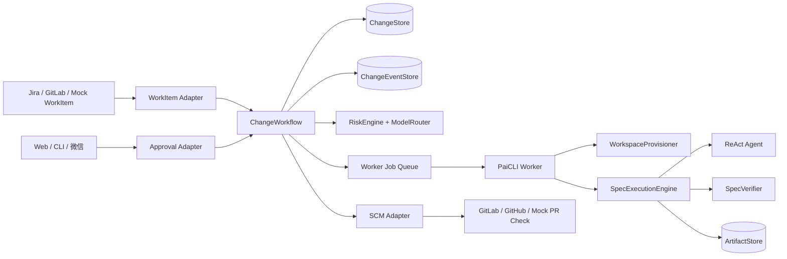
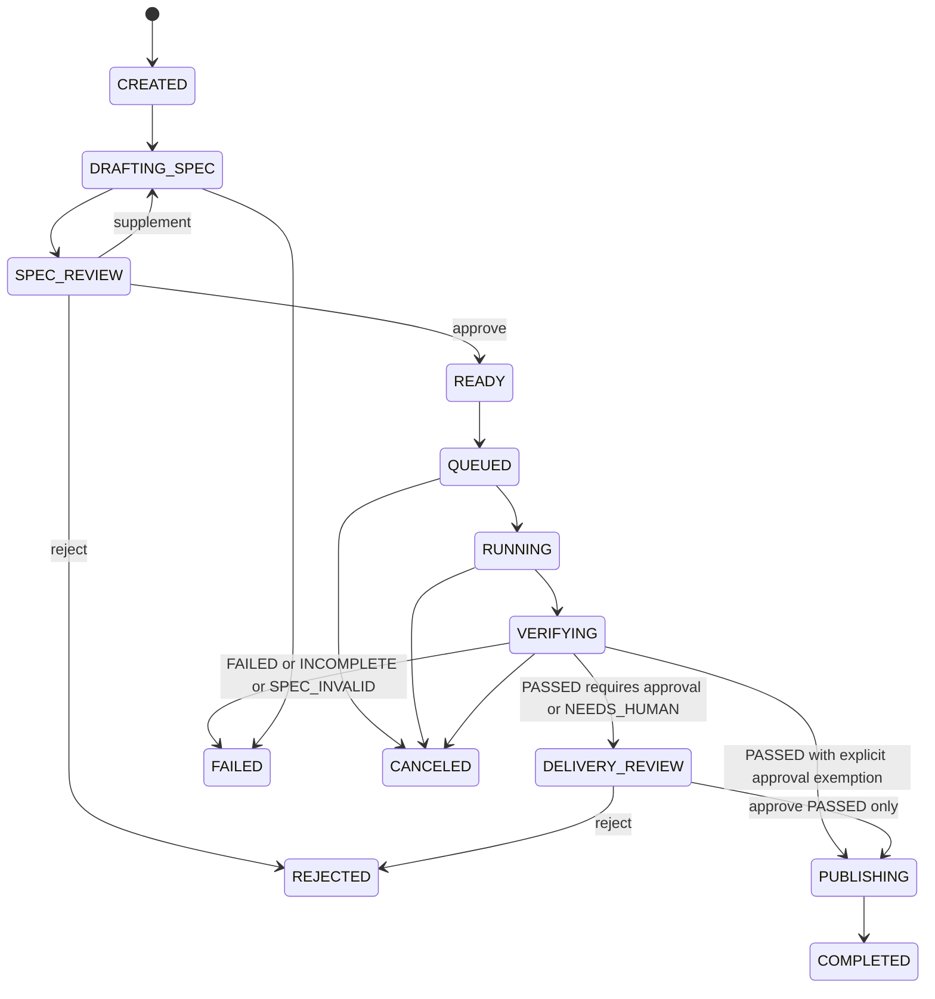
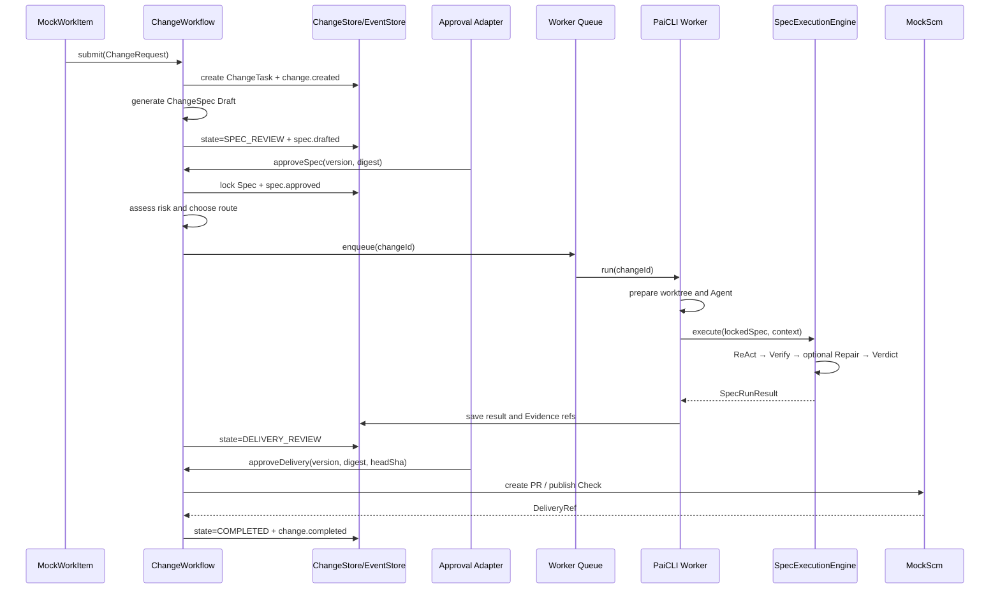

# PaiChange 企业 AI 研发变更交付平台改造计划

> 状态：APPROVED / Phase 1–6 本地后端、最小 Web 与离线 Mock 演示已完成；生产化能力未交付  
> 日期：2026-09-03  
> 批准日期：2026-09-03  
> 基线项目：PaiCLI `v16.1.0`  
> 工作名：`PaiChange`（已批准；PaiCLI 保留为 Worker 名称）  
> 本文性质：开发计划与架构提案；当前不代表已经交付企业平台能力

## 1. 决策摘要

本计划建议保留 PaiCLI 现有 CLI 和 Agent 能力，在其上新增以 `ChangeTask` 为核心业务对象的变更交付工作流，将 PaiCLI 从“整个产品”调整为平台执行平面的 Worker。

目标工作流：

```text
Jira / GitLab 工单
        ↓
创建 ChangeTask
        ↓
AI 生成 ChangeSpec
        ↓
负责人确认需求、范围、验收标准
        ↓
风险分级 + 模型 / Agent 路由
        ↓
PaiCLI Worker 在隔离工作区执行
        ↓
测试、范围、安全与业务规则验证
        ↓
失败 Evidence → 最多一次受控修复
        ↓
Tech Lead 审批
        ↓
创建 PR / 发布合并检查
        ↓
归档审计证据
```

本次改造的核心不是增加更多 Agent 功能，而是完成以下结构变化：

1. 新增 `ChangeWorkflow` 深模块，集中维护 ChangeTask 生命周期与业务不变量。
2. 将 ChangeSpec 的 Draft、确认锁定、执行验收拆成可暂停和恢复的阶段。
3. 将现有 ReAct Agent 封装为按 ChangeTask 创建的无状态 Worker。
4. 将 `DurableTaskManager` 保留为技术队列，不把它直接改造成业务 ChangeTask。
5. 将 CLI、HTTP、微信、工单系统和 Git 平台视为不同 Adapter，而不是业务逻辑所在地。
6. 第一阶段交付可演示的平台 MVP；真实 Jira/GitLab、RBAC、容器集群属于后续生产化范围。

## 2. 背景与问题

PaiCLI 已经具备 ReAct、Plan-and-Execute、Multi-Agent、Memory、RAG、MCP、HITL、Side-Git、Runtime API、后台任务和 ChangeSpec 等能力，但当前产品入口和核心对象仍然是本地 CLI Conversation。

现状存在四个结构性问题：

1. `/spec` 的 Draft、终端确认、Agent 执行、Verifier、Human Criterion 和结果展示全部由 `Main.java` 同步装配，无法在负责人稍后审批时暂停并恢复。
2. Runtime API 只提供 `thread / turn / input`，表达的是远程对话，不是企业代码变更。
3. `DurableTask` 只保存 prompt、result 和五态运行状态，无法表达仓库、Spec、风险、审批、PR、Evidence 与最终交付。
4. 当前 HITL 解决的是危险工具调用授权；它不等同于 Tech Lead 对代码交付的业务审批。

因此，本计划不把“增加 Jira 接口”当作改造完成。只有当系统拥有独立于 Conversation 的 ChangeTask、状态机、审批记录、交付结果与审计时间线时，PaiCLI 才开始具备平台形态。

## 3. 目标与非目标

### 3.1 目标

- 支持从工单或 HTTP 请求创建一个可持久化的 ChangeTask。
- 支持 ChangeSpec Draft 生成后暂停，等待异步审批，再继续执行。
- 支持按风险产生可解释的 ExecutionRoute。
- 支持每个 ChangeTask 使用独立工作区和独立 Agent 实例执行。
- 复用现有 ChangeSpec 锁定、Verifier、Evidence repair 与 Verdict。
- 支持 Spec 审批和 Delivery 审批两种独立业务决策。
- 支持把最终 Verdict 发布为模拟或真实 PR Check。
- 支持按 ChangeTask 回放完整业务事件和查阅 Evidence。
- 保持现有普通 ReAct、`/plan`、`/team`、`/spec` 和 Runtime API 兼容。

### 3.2 非目标

首个 MVP 不实现：

- 完整 Jira OAuth、GitLab App 或 GitHub App 安装流程；
- 面向公网的多租户 SaaS；
- 企业 SSO、完整 RBAC 和组织架构同步；
- Docker/Kubernetes 级强隔离；
- 高可用消息队列、分布式事务和跨地域灾备；
- 自动部署到生产环境；
- ChangeSpec 同时支持 ReAct、Plan 和 Team 三条执行路径；
- LLM 自动决定最终风险等级或绕过确定性策略；
- 以本计划宣称企业实际提效或生产落地。

## 4. 两级交付范围

### 4.1 Level A：面试可演示的平台 MVP

需要真实实现并可本地运行：

- ChangeTask 状态机；
- SQLite ChangeStore 和 ChangeEventStore；
- Change API；
- 异步 Spec Draft 审批与恢复；
- RiskEngine 和基础模型路由；
- 基于 Git worktree 的独立工作区；
- 真实调用现有 ReAct + SpecVerifier + Evidence repair；
- Delivery 审批；
- MockWorkItem 和 MockScm Adapter；
- ChangeTask 列表、详情、Spec 审批和 Evidence 时间线的最小 Web 页面；
- 一条首次验证失败、修复后通过的演示任务。

### 4.2 Level B：生产化架构设计

只要求在文档和架构图中设计清楚：

- Jira / GitLab / GitHub 真实连接；
- OIDC / SSO / RBAC；
- 容器或 Kubernetes Worker；
- Secret Manager；
- PostgreSQL、对象存储与正式消息队列；
- Required Check 与分支保护；
- 多租户隔离、配额、成本中心和 SLA；
- 跨仓库组织策略与审计导出。

Level B 不得在 README、简历或演示中标记为“已实现”。

## 5. 建议领域语言

以下术语在本计划审批后再同步到根目录 `CONTEXT.md`：

**ChangeTask**  
一个从外部需求进入到代码交付结束的持久业务对象。它跨越 Spec、执行、验证、审批和发布阶段。  
避免使用：Conversation、Thread、DurableTask、Spec Run。

**WorkItem**  
来自 Jira、GitLab Issue、GitHub Issue 或 Mock 输入的原始研发工作项。它是 ChangeTask 的来源，不等于 ChangeTask 本身。

**ExecutionRoute**  
RiskEngine 根据风险和组织策略产生的执行决策，包括 provider、model、执行模式、工具策略、是否允许修复和审批要求。

**Spec Approval**  
负责人对 ChangeSpec 的需求、范围、验收条件和 Verifier 的确认。它发生在代码执行之前。

**Delivery Approval**  
Tech Lead 基于最终 diff、Criterion Results、Evidence 和 Verdict 作出的交付决定。它发生在验证之后。

**Change Event**  
ChangeTask 生命周期中的不可变业务事实，例如 `spec.approved`、`verification.failed`、`delivery.approved`。

**Worker Job**  
技术队列中的一次后台执行。它通过 `changeId` 获取业务上下文，不是业务 ChangeTask。

## 6. 当前能力复用评估

| 工作流步骤 | 当前能力 | 处理方式 |
|---|---|---|
| 工单接入 | MCP、Runtime API | 新增 WorkItem Adapter |
| 创建 ChangeTask | `DurableTaskManager` 仅有技术任务 | 新增领域模型和 Store |
| 生成 ChangeSpec | `SpecDraftGenerator` | 直接复用 |
| 确认 ChangeSpec | `SpecDraftSession` 同步终端循环 | 拆成可持久化的异步决策 |
| 锁定 Spec | `SpecRunCoordinator.lock` | 提取为可独立调用的模块 |
| 风险分级 | 只有工具级 ApprovalPolicy | 新增 RiskEngine |
| 模型路由 | 多 provider Client + Factory | 新增按任务选择的 ModelRouter |
| Agent 执行 | ReAct / Plan / Team | MVP 只接 ReAct |
| 工作区隔离 | Side-Git 快照 | 新增 Git worktree Provisioner；Side-Git 继续做恢复 |
| 确定性验证 | `SpecVerifier` | 直接复用 |
| Evidence 修复 | `SpecRunCoordinator` | 直接复用现有最多一次策略 |
| Tech Lead 审批 | Human Criterion 与工具 HITL | 新增 Delivery Approval |
| PR / Check | 未实现 | MockScm；后续真实 Adapter |
| Evidence 归档 | `.paicli/runs` | 保留并关联 changeId；新增事件事实源 |

## 7. 目标架构



### 7.1 顶层深模块

新增 `ChangeWorkflow`，其 Interface 控制在三个操作：

```java
public interface ChangeWorkflow {
    ChangeTaskId submit(ChangeRequest request);

    ChangeTaskView decide(ChangeTaskId id, ChangeDecision decision);

    ChangeTaskView get(ChangeTaskId id);
}
```

该模块的实现负责隐藏：

- 状态迁移；
- 幂等与乐观锁；
- Spec Draft 与锁定；
- 风险评估与路由；
- Worker Job 投递；
- SpecRunResult 归并；
- 是否进入 Delivery Approval；
- PR Check 发布；
- Change Event 持久化。

Controller、CLI Handler 和 Adapter 不允许直接修改 ChangeState。

## 8. ChangeTask 数据模型

建议第一版使用不可变 Record 表达快照：

```java
public record ChangeTask(
        ChangeTaskId id,
        long version,
        ChangeState state,
        WorkItemRef source,
        RepositoryRef repository,
        String title,
        String requirement,
        SpecRef spec,
        RiskAssessment risk,
        ExecutionRoute route,
        RunRef run,
        ApprovalRecord specApproval,
        ApprovalRecord deliveryApproval,
        DeliveryRef delivery,
        Instant createdAt,
        Instant updatedAt
) {}
```

### 8.1 状态机



### 8.2 业务不变量

1. Spec 未批准时禁止进入 `READY`。
2. `Spec Approval` 必须绑定待确认 Draft digest；过期页面不能批准新 Draft。
3. Spec 锁定后 `specId + revision + digest` 不可变。
4. 同一个 ChangeTask 同时只能有一个活动 Worker Job。
5. Worker Job 只携带 `changeId`，业务上下文从 ChangeStore 加载。
6. RiskEngine 的规则结果是最终路由依据；LLM 只能提供说明或建议。
7. 每次执行必须绑定 repository、baseRef 和 workspace identity。
8. Delivery Approval 必须绑定最终 specDigest 和 headSha。
9. headSha 发生变化时，旧 Verification 与 Delivery Approval 自动失效。
10. Verdict 为 `FAILED` 或 `INCOMPLETE` 时不得发布成功 Check。
11. 发布成功前必须先持久化 Verdict、Evidence 与审批记录。
12. 高风险 ChangeTask 可配置“发起人不得审批自己的变更”。

## 9. ChangeSpec 模块改造

### 9.1 当前问题

`SpecRunCoordinator.run(String)` 同时完成 Draft 生成、用户确认、锁定、执行、验证、修复、人工 Criterion 和持久化。该 Interface 对 CLI 很深，但无法支持跨请求、跨时间的异步审批。

平台改造不能简单在外面再包一层 ChangeWorkflow 后继续调用同步 `run(String)`；否则 Web 请求仍然会阻塞等待终端输入。

### 9.2 目标拆分

#### ChangeSpecModule

```java
public interface ChangeSpecModule {
    SpecDraft generateDraft(ChangeContext context) throws IOException;

    LockedSpec lockConfirmed(
            SpecDraft draft,
            String expectedDigest
    ) throws IOException;
}
```

职责：

- 调用现有 `SpecDraftGenerator`；
- 结构校验；
- 保存 Draft；
- 校验 `expectedDigest`；
- 规范编码并不可覆盖地锁定；
- 回读验证 identity 与 digest。

#### SpecExecutionEngine

```java
public interface SpecExecutionEngine {
    SpecRunResult execute(
            LockedSpec spec,
            ExecutionContext context
    );
}
```

职责：

- 捕获 workspace baseline；
- 调用 ChangeExecutor；
- 执行 SpecVerifier；
- 聚合 Criterion Result；
- 按策略进行最多一次 Evidence repair；
- 执行 Human Criterion Adapter；
- 生成 Verdict 与运行指标；
- 保存运行 Artifact。

### 9.3 CLI 兼容方式

保留 `SpecDraftSession` 作为 CLI Adapter：

```text
/spec
→ ChangeSpecModule.generateDraft
→ Terminal Review Adapter
→ ChangeSpecModule.lockConfirmed
→ SpecExecutionEngine.execute
→ ChangeSpecCliFormatter
```

这样原 CLI 行为不变，平台和 CLI 复用同一实现。

## 10. Worker 与工作区

### 10.1 Worker Interface

```java
public interface ChangeWorker {
    void run(ChangeTaskId changeId);
}
```

Worker 的实现顺序：

1. 从 ChangeStore 加载 ChangeTask；
2. 使用 version 和 state 抢占任务；
3. 调用 WorkspaceProvisioner；
4. 根据 ExecutionRoute 创建 LlmClient、ToolRegistry 和 Agent；
5. 调用 SpecExecutionEngine；
6. 保存 runId、Verdict、Evidence 路径和 headSha；
7. 通知 ChangeWorkflow 推进状态；
8. 释放工作区。

### 10.2 DurableTaskManager 改造

`DurableTaskManager` 保留技术队列职责，但业务任务不再把原始 prompt 作为唯一载荷。

推荐新增：

```java
public record WorkerJob(
        String id,
        String type,
        String referenceId,
        WorkerJobStatus status
) {}
```

ChangeTask 投递示例：

```text
type = "change.execute"
referenceId = changeId
```

不建议直接把 `DurableTask` 重命名为 `ChangeTask`，否则业务状态和线程执行状态会永久耦合。

### 10.3 WorkspaceProvisioner

```java
public interface WorkspaceProvisioner {
    WorkspaceLease prepare(ChangeTask task) throws Exception;

    void release(WorkspaceLease lease);
}
```

MVP Adapter：

- 从本地配置的仓库创建临时 Git worktree；
- 校验 worktree 路径位于平台工作根目录；
- 每个 ChangeTask 创建独立 Agent 和 ToolRegistry；
- 最终 commit/headSha、changed files 和 diff 进入 Evidence；
- Side-Git 继续用于任务内部恢复，不宣称提供强安全隔离。

生产设计：Docker 或 Kubernetes Job，每个任务独立文件系统、CPU/内存限制、网络策略和短期凭证。

## 11. RiskEngine 与 ExecutionRoute

### 11.1 规则输入

- WorkItem 标签与优先级；
- `scope.mode`；
- include / exclude 路径；
- 是否修改认证、权限、支付、安全或配置目录；
- 是否涉及数据库迁移、依赖或公共 Interface；
- deterministic Verifier 覆盖情况；
- Human Criterion 数量；
- 仓库级策略。

### 11.2 初始评分建议

| 条件 | 分值 |
|---|---:|
| `scope.mode=open` | +2 |
| 修改认证/支付/权限目录 | +3 |
| 数据库迁移 | +3 |
| 公共 Interface 或兼容性变化 | +2 |
| 没有 command Verifier | +2 |
| 存在 Human Criterion | +1 |
| 工单显式标记 high-risk | 直接 HIGH |

```text
0-2  → LOW
3-5  → MEDIUM
6+   → HIGH
```

阈值是 MVP 产品假设，需要在真实试点后校准。

### 11.3 路由输出

```java
public record ExecutionRoute(
        RiskLevel riskLevel,
        String provider,
        String model,
        ExecutionMode executionMode,
        boolean repairEnabled,
        boolean specApprovalRequired,
        boolean deliveryApprovalRequired,
        ToolPolicyProfile toolPolicy
) {}
```

MVP 约束：

- `executionMode` 固定为 `REACT`；
- RiskEngine 只路由 provider/model、工具策略和审批要求；
- Plan/Team 路由在后续 ChangeSpec 版本中实现；
- 不允许 LLM 直接输出最终风险等级并覆盖规则。

## 12. 审批模型

### 12.1 审批记录

```java
public record ApprovalRecord(
        String approvalId,
        ChangeTaskId changeId,
        ApprovalStage stage,
        ApprovalDecision decision,
        String approverId,
        String reason,
        String specDigest,
        String headSha,
        Instant decidedAt
) {}
```

`ApprovalStage`：

- `SPEC`
- `DELIVERY`

`ApprovalDecision`：

- `APPROVE`
- `REJECT`
- `SUPPLEMENT`

### 12.2 与工具 HITL 的关系

- `ApprovalPolicy` 和 `HitlToolRegistry` 继续决定某次工具调用是否允许。
- `ApprovalRecord` 决定 ChangeTask 是否可以继续到执行或发布阶段。
- 两类审批不能共用状态、枚举和日志。

### 12.3 并发与过期审批

所有审批请求必须带：

- `expectedVersion`；
- Spec 阶段带 `expectedDraftDigest`；
- Delivery 阶段带 `expectedSpecDigest + expectedHeadSha`。

不匹配时返回 `409 Conflict`，防止负责人批准已经变化的内容。

## 13. 外部 Adapter

### 13.1 WorkItem

第一阶段直接实现 `MockWorkItemAdapter`，从 JSON fixture 创建 WorkItem。只有准备实现第二个 Adapter 时，才正式提取稳定的 WorkItem Interface，避免只为一个实现制造浅层转发。

后续候选 Adapter：

- `GitLabIssueAdapter`
- `JiraIssueAdapter`
- `GitHubIssueAdapter`

统一映射字段：

```text
sourceType
externalId
title
description
labels
priority
requester
repository
baseRef
sourceUrl
```

### 13.2 SCM

目标 Interface：

```java
public interface ScmAdapter {
    DeliveryRef createOrUpdatePullRequest(ChangeDelivery delivery);

    void publishCheck(
            DeliveryRef delivery,
            String headSha,
            CheckConclusion conclusion,
            EvidenceSummary evidence
    );
}
```

MVP 使用 `MockScmAdapter` 将 PR 与 Check 结果保存到 SQLite，并在 Web 页面展示。

发布规则：

- `PASSED + 审批通过` → success；
- `FAILED / INCOMPLETE / SPEC_INVALID` → failure；
- `NEEDS_HUMAN` → pending；
- Check 必须绑定当前 headSha；
- headSha 改变后旧 Check 和审批均不可复用。

## 14. 持久化设计

MVP 继续使用 SQLite，建议新增以下表：

### 14.1 `change_tasks`

```text
id                  TEXT PRIMARY KEY
version             INTEGER NOT NULL
state               TEXT NOT NULL
source_type         TEXT
source_external_id  TEXT
source_url          TEXT
repository          TEXT NOT NULL
base_ref            TEXT NOT NULL
title               TEXT NOT NULL
requirement         TEXT NOT NULL
spec_id             TEXT
spec_revision       INTEGER
spec_digest         TEXT
spec_path           TEXT
risk_level          TEXT
risk_score          INTEGER
risk_reasons_json   TEXT
route_json          TEXT
run_id              TEXT
verdict             TEXT
head_sha            TEXT
delivery_ref_json   TEXT
created_at          TEXT NOT NULL
updated_at          TEXT NOT NULL
```

### 14.2 `change_events`

```text
id              INTEGER PRIMARY KEY AUTOINCREMENT
change_id       TEXT NOT NULL
event_type      TEXT NOT NULL
actor_type      TEXT NOT NULL
actor_id        TEXT
previous_state  TEXT
new_state       TEXT
payload_json    TEXT NOT NULL
created_at      TEXT NOT NULL
```

### 14.3 `change_approvals`

```text
id             TEXT PRIMARY KEY
change_id      TEXT NOT NULL
stage          TEXT NOT NULL
decision       TEXT NOT NULL
approver_id    TEXT NOT NULL
reason         TEXT
spec_digest    TEXT
head_sha       TEXT
created_at     TEXT NOT NULL
```

### 14.4 `change_artifacts`

```text
id             TEXT PRIMARY KEY
change_id      TEXT NOT NULL
run_id         TEXT
kind           TEXT NOT NULL
path_or_uri    TEXT NOT NULL
sha256         TEXT NOT NULL
created_at     TEXT NOT NULL
```

ChangeTask 状态更新与 Change Event 追加必须处于同一数据库事务中。业务事件持久化失败时不得继续推进状态。

## 15. Change Event 设计

首版事件：

```text
change.created
spec.drafting_started
spec.drafted
spec.supplement_requested
spec.approved
spec.rejected
risk.assessed
execution.queued
execution.started
verification.attempt_completed
repair.started
execution.completed
delivery.approved
delivery.rejected
pr.check_published
change.completed
change.failed
change.canceled
```

现有 `AuditLog` 继续记录具体工具副作用；ChangeEventStore 记录业务生命周期。两者通过 `changeId` 和 `runId` 关联，但不能互相替代。

## 16. HTTP Interface

保留现有 `/v1/threads`，新增 `/v1/changes`。

### 16.1 创建 ChangeTask

```http
POST /v1/changes
Content-Type: application/json
```

```json
{
  "idempotencyKey": "mock-payment-1842-v1",
  "actorId": "developer-001",
  "source": {
    "type": "mock_gitlab_issue",
    "externalId": "PAY-1842",
    "url": "https://gitlab.example.com/payment/refund/-/issues/1842"
  },
  "repository": {
    "path": "/workspace/refund-service",
    "baseRef": "main"
  },
  "title": "修复退款超时逻辑",
  "requirement": "退款超过24小时必须进入人工审核，不能影响自动取消流程"
}
```

成功响应为 `201 Created`（幂等重放也返回同一任务及 201），带 `Location`。当前 Draft 在请求内生成后返回，通常已进入 `SPEC_REVIEW`；生成失败则返回已持久化的 `FAILED` 任务。以下只展示响应的一部分，完整响应还包含 repository/source/spec/risk/route/run/approval/delivery 字段：

```json
{
  "changeId": "change_0123456789ab",
  "version": 2,
  "state": "SPEC_REVIEW"
}
```

### 16.2 查询任务

```http
GET /v1/changes
GET /v1/changes/{changeId}
GET /v1/changes/{changeId}/events?after=0
GET /v1/changes/{changeId}/artifacts
GET /v1/changes/{changeId}/artifacts?fromRevision=1&toRevision=2
GET /v1/changes/capabilities
```

列表响应为 `{"changes":[...]}`；事件响应为 `{"events":[...]}`，按 `sequence` 升序，只返回 `sequence > after`。这是有限 JSON 回放，非 SSE 长连接；原 threads 的 SSE 端点保持原行为。

### 16.3 Spec 决策

```http
POST /v1/changes/{changeId}/spec-decisions
```

```json
{
  "decision": "APPROVE",
  "expectedVersion": 3,
  "expectedDraftDigest": "sha256:...",
  "actorId": "techlead-001",
  "reason": "范围和验收条件确认"
}
```

### 16.4 Delivery 决策

```http
POST /v1/changes/{changeId}/delivery-decisions
```

```json
{
  "decision": "APPROVE",
  "expectedVersion": 8,
  "expectedSpecDigest": "sha256:...",
  "expectedHeadSha": "abc123",
  "expectedRunId": "run-current",
  "expectedJudgmentRevision": 0,
  "actorId": "techlead-001",
  "reason": "Evidence 完整，批准发布 Check"
}
```

### 16.5 错误约定

| HTTP 状态 | 含义 |
|---|---|
| 400 | 请求结构或字段错误 |
| 401 | 未认证 |
| 403 | 当前 actor 无权执行决策 |
| 404 | ChangeTask 不存在 |
| 409 | 状态、version、digest、run、headSha 或判断版本已过期 |
| 422 | 决策不满足业务不变量 |
| 500 | 未预期内部错误 |

当前实现共用 Runtime API 的 `127.0.0.1` 监听及 `Authorization: Bearer <key>` / `X-PaiCLI-API-Key` 校验。`actorId` 仅用于演示，客户端仍可填写它，403 仅表示触发职责分离规则，不构成 RBAC 或可靠身份认证。所有决策必须使用最近 GET 返回的版本与 digest；交付决策另绑定 run/head/判断版本；重复旧决策返回 409，不产生重复执行或 PR。

`SUPPLEMENT` 还需 `supplement` 文本；Delivery 仅支持 `APPROVE / REJECT`。`NEEDS_HUMAN` 的 APPROVE 返回 422，仍保留 pending Check；M2 已增加独立 human-evidence 入口，并显式绑定 run 与判断版本，见 `paichange-m2-implementation.md`。请求体上限 1 MiB，字段类型/重复 JSON key/尾随 JSON/无效事件游标映射 400，内部异常响应不会直接暴露内部堆栈。

## 17. 包与文件改造建议

### 17.1 新增

```text
src/main/java/com/paicli/change/
├── ChangeWorkflow.java
├── DefaultChangeWorkflow.java
├── ChangeTask.java
├── ChangeTaskId.java
├── ChangeTaskView.java
├── ChangeRequest.java
├── ChangeDecision.java
├── ChangeState.java
├── ChangeEvent.java
├── ChangeStore.java
├── SqliteChangeStore.java
├── InMemoryChangeStore.java
├── ChangeEventStore.java
├── RiskEngine.java
├── ExecutionRoute.java
├── ChangeWorker.java
└── WorkspaceProvisioner.java

src/main/java/com/paicli/integration/
├── workitem/MockWorkItemAdapter.java
├── scm/MockScmAdapter.java
└── approval/HttpApprovalAdapter.java

src/main/java/com/paicli/runtime/api/
├── ChangeApiHandler.java
├── ChangeRequestJson.java
└── ChangeDecisionJson.java
```

### 17.2 改造

| 文件 | 改造内容 |
|---|---|
| `Main.java` | 只负责装配 CLI Adapter，不再内联完整 Spec 工作流 |
| `SpecRunCoordinator.java` | 提取 Draft/lock 与 Execution 两阶段，保留现有验收语义 |
| `SpecDraftSession.java` | 降级为同步 CLI Adapter，调用新的 ChangeSpecModule |
| `SpecRunStore.java` | Artifact 关联 changeId/runId；保留不可覆盖写入 |
| `SpecRunResult.java` | 增加可选 changeId、workspace/headSha 引用，保持 V1 JSON 兼容策略 |
| `DurableTaskManager.java` | 支持 WorkerJob referenceId，不承载 ChangeTask 全量字段 |
| `RuntimeApiServer.java` | 注册 ChangeApiHandler，保留 threads 端点 |
| `LlmClientFactory.java` | 支持按 ExecutionRoute 创建任务级 Client |
| `AuditLog.java` | 增加可选 changeId/runId 元数据，不改变工具审计职责 |
| `README.md` | MVP 交付后再更新平台定位、运行方式和状态边界 |
| `AGENTS.md` | MVP 交付后同步架构、命令、测试和未交付边界 |

### 17.3 暂不改造

- `Agent.java`
- `PlanExecuteAgent.java`
- `AgentOrchestrator.java`
- `ToolRegistry.java`
- 各 provider Client
- `SpecVerifier` 的当前 path_scope 和 command 语义
- ChangeSpec V1 schema

## 18. 端到端时序



## 19. 实施阶段

### Phase 0：审批与契约冻结

交付物：

- 审批本文；
- 确认平台工作名；
- 确认 MVP 使用 Mock GitLab 还是接入真实 GitLab；
- 确认 ChangeTask 状态与业务不变量；
- 审批后更新 `CONTEXT.md`；
- 如状态机与 DurableTask 分离决策正式接受，再创建 ADR。

验收：所有待决策项有明确结论，不修改生产代码。

### Phase 1：ChangeTask 内核

实现：

- ChangeTask、ChangeState、ChangeDecision；
- ChangeWorkflow Interface；
- SQLite/InMemory ChangeStore；
- ChangeEventStore；
- 状态机、幂等、version 乐观锁；
- 领域级测试。

验收：

- 非法迁移被拒绝；
- 重复请求不产生重复执行；
- 状态与事件同事务提交；
- 过期 version 返回冲突；
- 测试不依赖 LLM 和网络。

### Phase 2：异步 ChangeSpec

实现：

- 提取 ChangeSpecModule；
- 提取 SpecExecutionEngine；
- Draft 持久化与 digest 检查；
- CLI Adapter 保持 `/spec` 兼容；
- Spec approve/supplement/reject 决策。

验收：

- Web/API 请求生成 Draft 后可以终止进程并恢复；
- Approve 后锁定文件不可覆盖；
- 过期 digest 无法确认；
- 原有 SpecRunCoordinatorTest 语义不回退；
- `/spec` 原交互回归通过。

### Phase 3：Worker 与工作区

实现：

- WorkerJob 只携带 changeId；
- ChangeWorker；
- Git worktree WorkspaceProvisioner；
- 每任务独立 Agent、ToolRegistry 和 LlmClient；
- ChangeTask 与 SpecRunResult 关联。

验收：

- 两个任务不共享会话与工作区；
- 同 ChangeTask 不会被两个 Worker 同时执行；
- 进程重启后遗留任务可恢复；
- 取消任务会产生明确状态和事件；
- 原工作树的用户改动不会被 Worker 覆盖。

### Phase 4：Risk 与审批

实现：

- RiskEngine；
- ExecutionRoute；
- provider/model 路由；
- Spec Approval 与 Delivery Approval；
- 过期审批保护；
- 中高风险禁止自批的可配置规则。

验收：

- 同一输入得到稳定、可解释的风险结果；
- LLM 无法覆盖确定性风险；
- HIGH 风险没有 Delivery Approval 时不能发布成功 Check；
- headSha 变化使审批失效。

### Phase 5：Change API 与 Mock Adapter

实现：

- `/v1/changes` 全部端点；
- Change events 回放；
- MockWorkItemAdapter；
- MockScmAdapter；
- API 错误映射；
- API Key 认证复用。

验收：

- 可通过 HTTP 完成完整 ChangeTask 生命周期；
- Runtime threads 端点保持兼容；
- PR Check 绑定 headSha；
- 错误状态使用 409/422，不统一返回 500。

### Phase 6：最小 Web 演示

页面：

1. ChangeTask 列表；
2. ChangeTask 详情与事件时间线；
3. ChangeSpec Diff/确认页；
4. Risk 与 ExecutionRoute；
5. Evidence、Verifier 与 Criterion Results；
6. Delivery Approval；
7. Mock PR Check。

验收：能够在五分钟内完整演示一条首次失败、受控修复后通过的任务。

### Phase 7：生产化设计补全

2026-09-04：六项后续能力已另行整理为[后续开发计划](paichange-next-development-plan.md)，包含优先级、依赖、实施切片与验收标准。随后 M1 Draft 异步生成与中断恢复已完成，见 [M1 实施记录](paichange-m1-implementation.md)；M2 Human Evidence 也已完成，见 [M2 实施记录](paichange-m2-implementation.md)；M3–M6 仍待开发。本文 Phase 7 继续保留为设计纲要；具体实施使用新计划的 M1–M6 编号。

只补文档，不作为 MVP 交付：

- GitLab/Jira Adapter 安全模型；
- Worker 容器化；
- RBAC 与职责分离；
- Secret 注入与网络隔离；
- PostgreSQL/Queue/Object Storage 迁移；
- 部署、扩缩容、SLA、灾备和审计导出。

## 20. 测试计划

### 20.1 新增测试

```text
ChangeWorkflowTest
ChangeStateMachineTest
SqliteChangeStoreTest
ChangeEventStoreTest
RiskEngineTest
ChangeSpecModuleTest
SpecExecutionEngineTest
ChangeWorkerTest
GitWorktreeWorkspaceProvisionerTest
ChangeApiHandlerTest
MockScmAdapterTest
ChangePlatformEndToEndTest
```

### 20.2 关键测试场景

- Draft digest 过期审批；
- ChangeTask version 并发冲突；
- Worker 重复领取；
- Worker 崩溃后恢复；
- Spec 被篡改；
- headSha 变化后旧 Verdict/Approval 失效；
- Verifier FAIL 后修复成功；
- Verifier ERROR 时禁止修复和放行；
- Evidence 持久化失败时禁止发布成功 Check；
- HIGH 风险发起人自批被拒绝；
- API 重放不产生重复 PR；
- 两个并行 ChangeTask 工作区互不污染。

### 20.3 回归命令

开发期间针对性运行：

```bash
mvn test -Dtest=ChangeWorkflowTest,ChangeStateMachineTest,SqliteChangeStoreTest
mvn test -Dtest=ChangeSpecModuleTest,SpecExecutionEngineTest,SpecRunCoordinatorTest,SpecVerifierTest
mvn test -Dtest=ChangeWorkerTest,DurableTaskManagerTest,RuntimeApiServerTest
mvn test -Dtest=ChangeApiHandlerTest,ChangePlatformEndToEndTest
```

完成后：

```bash
mvn test -Pquick
```

`mvn test -Pchange-spec-eval` 会产生真实模型费用，未经单独批准不得运行。

## 21. 可观测性与产品指标

每个 ChangeTask 记录：

- 工单进入到 Spec Draft 的耗时；
- Spec 等待审批的人时和墙钟；
- 风险等级与路由理由；
- Worker 排队、执行、验证、修复耗时；
- LLM calls、input/output/cache tokens 和成本；
- 首轮验证通过率；
- 修复机会与条件修复成功率；
- Verdict 分布；
- Delivery Approval 等待时间；
- PR Check 结果；
- change failure / cancel / reject 原因。

MVP 只展示事实，不宣称降低 Reviewer 时间或提升成功率。真实收益需要后续真实工单试点验证。

## 22. 安全与可靠性边界

### MVP 已承诺

- API 只监听 localhost；
- API Key 必填；
- Worker 的 PathGuard / CommandGuard 已复用；工具 HITL 是待兑现要求：当前 Worker 工厂未装配交互 HITL Handler 或组织白名单，不能描述为已生效；
- ChangeSpec digest 和 headSha 参与审批校验；
- 每任务独立 Git worktree；
- 业务状态与事件持久化失败时禁止继续放行；
- Evidence 输出继续脱敏和截断；
- 不自动部署生产。

### MVP 未承诺

- Git worktree 不是安全沙箱；
- 单 API Key 不构成企业 RBAC；
- 本地 SQLite 不构成高可用存储；
- Mock PR Check 不构成真实分支保护；
- Tool audit JSONL 不构成不可抵赖审计；
- 现阶段不能安全地作为公网服务运行。

## 23. 演示脚本

演示任务：支付系统退款超时规则。

```text
需求：退款超过24小时必须进入人工审核，且不能影响自动取消流程。
```

五分钟演示：

1. Mock GitLab Issue 触发创建 ChangeTask。
2. Web 页面显示 `DRAFTING_SPEC → SPEC_REVIEW`。
3. 展示 ChangeSpec 的 goal、non-goals、scope、AC 和 Verifier。
4. Tech Lead 点击批准，系统展示 risk=MEDIUM 及理由。
5. Worker 创建独立 worktree 并运行现有 ReAct。
6. 第一次 Verifier 因边界测试失败，页面展示 Evidence。
7. 现有受控修复执行一次，第二轮验证通过。
8. ChangeTask 进入 `DELIVERY_REVIEW`，展示 diff 与 AC-Evidence 映射。
9. Tech Lead 批准，MockScm 发布 success Check。
10. 页面展示从 `change.created` 到 `change.completed` 的完整时间线。

## 24. 完成定义

平台 MVP 完成必须同时满足：

- ChangeTask 是独立于 Conversation 和 DurableTask 的业务对象；
- Spec 审批可以跨 HTTP 请求暂停和恢复；
- ChangeWorkflow 集中维护全部状态迁移；
- Worker 通过 changeId 运行，不以 prompt 作为事实源；
- 每个任务使用独立工作区与 Agent 实例；
- 真实复用 ChangeSpec、Verifier、Evidence repair 和 Verdict；
- Delivery Approval 绑定 specDigest 和 headSha；
- Mock PR Check 根据最终 Verdict 发布；
- 业务事件可完整回放；
- 原 CLI 和 Runtime thread 路径不回退；
- `mvn test -Pquick` 通过；
- README/AGENTS 明确区分已实现 MVP 与生产化设计。

## 25. 风险与取舍

### 25.1 最大风险：平台只是套壳

如果 Web 页面最终只是把字符串 prompt 发给 `/v1/threads/{id}/turns`，则仍然是 CLI 套壳，改造失败。验收时必须检查是否存在独立 ChangeTask、状态机、审批、Evidence 和 PR Check。

### 25.2 最大工程风险：SpecRunCoordinator 拆分造成语义回退

现有 ChangeSpec 对锁定、baseline、Verifier 顺序、JUnit 新鲜度、修复条件、Verdict 归约和 Artifact 有大量已验证语义。拆分时应先建立现有行为的 Characterization Tests，再移动职责，不重写算法。

### 25.3 状态过多

内部事件可以细，外部状态应保持有限。只有需要暂停、恢复、审批或对用户解释的阶段才成为 ChangeState，其余作为 Change Event。

### 25.4 过早抽象 Adapter

只有当第二个实现真实出现时才提取稳定 Seam。MVP 可以先用 Mock 实现跑通用例，再在 GitLab Adapter 开发时收敛 Interface。

### 25.5 风险路由缺乏真实数据

初始评分只是规则假设。系统必须保存 reasons 和实际结果，后续用失败、人工否决和返工数据校准，不能把第一版权重描述为行业标准。

## 26. 已批准决策

| 编号 | 决策 | 批准结论 |
|---|---|---|
| D1 | 平台工作名 | `PaiChange`，PaiCLI 保留为 Worker 名称 |
| D2 | MVP 工单来源 | 先 Mock GitLab Issue，不做 Jira OAuth |
| D3 | MVP SCM | Mock PR Check；有余力再接真实 GitLab |
| D4 | 工作区隔离 | 本地 Git worktree；容器只做生产设计 |
| D5 | MVP 执行模式 | ChangeSpec + ReAct，不接 Plan/Team |
| D6 | 风险路由范围 | 路由模型、工具策略和审批，不由 LLM 定风险 |
| D7 | 审批入口 | HTTP/Web 为主，CLI 保持兼容，微信后续接入 |
| D8 | 存储 | SQLite 单库保存 ChangeTask/Event/Approval |
| D9 | 现有 Runtime API | 保留 threads/turns，新增 changes，不破坏兼容 |
| D10 | 文档同步 | MVP 实现后再更新 README/AGENTS 的已交付状态 |

以上 D1～D10 已于 2026-09-03 按表中结论批准。

## 27. 实施记录

### 2026-09-03：Phase 0 完成，Phase 1-3 核心落地

已完成：

- 冻结 D1～D10；
- 新增 `ChangeWorkflow` 三操作 Interface；
- 新增 ChangeTask、ChangeState、ChangeDecision、SpecRef 与 ApprovalRecord；
- 新增 InMemory/SQLite ChangeStore 与 ChangeEventStore；
- 状态和 Event 在 SQLite 同一事务提交；
- 实现幂等提交、version 乐观锁、过期 digest 拒绝；
- 实现 Draft 生成、不可覆盖保存、digest 校验和不可覆盖锁定；
- 支持 supplement 后生成同一 specId 的下一 revision；
- 新增 `SpecExecutionEngine` Interface，现有 `SpecRunCoordinator` 实现该 Interface；
- `/spec` 锁定路径改用 `FileChangeSpecModule`，现有执行、Verifier 与 repair 语义保持不变；
- 添加无模型、无网络的领域与持久化测试。
- `DurableTaskManager` 新增 reference-only Worker Job，`change.execute` 任务只保存 `changeId`，并保持原 prompt task 兼容；
- 新增 ChangeTask 执行领取凭据和 Worker 生命周期 seam，原子记录 queue、claim、start、verification、recovery、cancel、failure 与 completion Event；
- 新增 `DefaultChangeWorker`，按 `changeId` 回读业务上下文并把 `runId + specDigest + Verdict + workspaceId + branch + headSha + Evidence path` 关联回 ChangeTask；
- 新增任务级 PaiCLI Runtime Factory，每次创建新的 LlmClient、ToolRegistry、Agent 和 SpecExecutionEngine；
- 新增 Git worktree WorkspaceProvisioner，从已提交 baseRef 创建隔离分支，不复制原 checkout 的未提交改动；运行结束封存 commit/headSha，Evidence 写到 worktree 外后释放 worktree；
- SQLite 自动迁移 Phase 3 的 claim/run 与 Worker Job 列，进程重启时将遗留 RUNNING Job 恢复为 ENQUEUED，并在业务时间线记录 recovery；
- 添加无模型、无网络（Git worktree 测试只依赖本地 Git）的 Worker、队列恢复、取消、重复领取与工作区隔离测试。

当前边界：

- 尚未注册 `/v1/changes` HTTP 入口；它属于 Phase 5；
- 尚未实现 Web 页面和 SCM Adapter；
- Phase 3 模块已可装配，但 Worker Job 仍由 Adapter 显式投递；完整 HTTP 自动编排属于 Phase 5；
- 因此当前仍不能把 PaiChange MVP 表述为已交付。

### 2026-09-04：Phase 4 Risk 与审批核心落地

已完成：

- 新增纯确定性的 `RiskEngine`，按锁定规则评估 `scope.mode`、敏感目录、数据库迁移、公共 Interface/兼容性、command Verifier、Human Criterion 和 Work Item `high-risk` 标签；输出稳定的 `score + level + reasons`，Interface 不接受 LLM 覆盖值；
- `WorkItemRef` 增加 labels/priority，`ChangeTask` 增加 requester、RiskAssessment、ExecutionRoute 和 Delivery Approval，并由 SQLite 持久化及重启回读；
- 新增 `ExecutionRoute` 与 `ExecutionRouter`，MVP 执行模式固定 `REACT`，按风险和 `PaiCliConfig.paiChange.routes` 选择 provider/model、repair、Delivery Approval 和工具策略；HIGH 默认关闭 repair、使用 `LOCKED_DOWN`，且不能通过配置取消 Delivery Approval；
- `PaicliChangeWorkerRuntimeFactory` 按 ChangeTask 已固化的 route 创建任务级 LlmClient，不修改共享 provider 配置，并把 route 的 repair 策略传给 `SpecRunCoordinator`；
- Spec Approval 在锁定前校验 expectedVersion 和 Draft digest，先运行确定性风险规则及职责分离策略，再保存 risk/route；中高风险自批被拒绝时不会遗留锁定文件；
- Delivery Approval 由 `ChangeWorkflow.decide(...)` 集中处理，必须同时匹配 expectedVersion、当前 specDigest 和最终 headSha；批准后进入 `PUBLISHING`，拒绝后进入 `REJECTED`，过期页面和变化后的代码身份不能复用旧审批；
- 新增可配置的中高风险发起人自批规则，默认禁止，可通过 `PaiCliConfig.paiChange.forbidRequesterSelfApprovalForMediumAndHigh=false` 关闭；该规则只约束业务 Approval，不与工具 HITL 共用状态；
- SQLite 新增 Phase 4 列和 `change_approvals` 表；ChangeTask、Approval 与 Change Event 在同一事务写入，后续 Worker 状态变化不会丢失已有审批记录；
- 新增无模型、无外网的 RiskEngine、ExecutionRouter、过期审批、职责分离、路由模型覆盖和 SQLite 重启恢复测试；Phase 1-4 联合针对性回归为 69 tests、0 failures/errors；沙箱外 `mvn test -Pquick` 为 879 tests、0 failures/errors、5 skipped。

当前边界：

- 未新增 `/v1/changes`、HTTP 错误映射、Mock WorkItem/SCM Adapter 或 Web 页面；这些仍属于 Phase 5-6；
- `ExecutionRoute.toolPolicy` 已作为可审计路由结果固化；MVP 现有 Worker 继续复用 ToolRegistry/HITL，后续平台装配时再把 profile 映射到组织级工具白名单；
- `PUBLISHING` 只表示 Delivery Approval 已通过或 route 明确免批，尚未发布 PR Check；只有 Phase 5 SCM Adapter 成功后才能进入 `COMPLETED`；
- 因此当前表述仍是“Phase 1-4 核心完成”，不能表述为 PaiChange 平台 MVP 已交付。

### 2026-09-04：Phase 5 Change API 与 Mock Adapter 完成

本次先核对 AGENTS/CONTEXT、Phase 1–4 的实现及联合测试，保留既有未提交改动，未改动 demo 中的无关文件。

已完成：

- 新增 `ChangeApiHandler`；`serve --http` 在原 RuntimeApiServer 内装配 `/v1/changes` 创建、列表、详情、事件回放、Spec/Delivery 决策，与 threads 共用 localhost 与 API Key。原 RuntimeApiServer 构造签名及 threads 响应/SSE 行为保持兼容。
- 新增 `ChangePlatform` 本地装配，ChangeTask/Event/Approval、reference-only Worker Job 和 Mock PR/Check 共用 `changes.db`；平台数据目录默认 `~/.paichange`，支持 `PAICHANGE_DATA_DIR` / `-Dpaichange.data.dir`。数据目录持有进程锁，当前只支持一个服务进程。
- Spec 批准先持久化审批、确定性风险和 ExecutionRoute，再进入 READY/QUEUED 并投递 `change.execute(changeId)`；Handler/Adapter 不直接修改业务状态。后台扫描持久化状态补偿 READY→QUEUED→技术 Job 与 PUBLISHING→SCM→COMPLETED 之间的中断窗口。
- 新增 `MockWorkItemAdapter`，从平台 `fixtures/` 目录读 JSON；按 sourceType/externalId/title/description/labels/priority/requester/repository/sourceUrl 映射领域请求，以 idempotencyKey 幂等提交。HTTP 可发送 `{"fixture":"local-issue.json"}`；只接受固定目录内的文件名，检查真实路径，拒绝目录遍历/符号链接逃逸。样例见 `docs/fixtures/paichange/local-issue.json`，使用前需填写本地仓库与真实需求。
- 新增 `MockScmAdapter`，本地 SQLite 表 `mock_pull_requests` 按 changeId 唯一，`mock_pr_checks` 按 changeId/specDigest/headSha 唯一，PR 与 Check 同事务保存；不调用任何远程 Git 平台。查询详情中的 delivery 直接回读该持久化记录。
- 发布资格仍在 `DefaultChangeWorkflow` 内集中维护。发布前重读锁定 Spec，检查 specId/revision/digest；用本地 `git rev-parse` 回读封存分支 head；核对 RunRef 与 `result.json` 的 runId/specDigest/status/Verdict、Evidence 数组和 `change.diff` 文件；再检查有效 Spec Approval、当前 Delivery Approval、风险与 route。
- HIGH 即使状态异常地进入 PUBLISHING，也不能在缺少有效 Delivery Approval 时发布 success；只有 FINISHED/PASSED 满足审批要求才可 success。NEEDS_HUMAN 固定发布 pending 并停在 DELIVERY_REVIEW；Delivery Approval 不负责覆盖或重算 Verdict，其 APPROVE 返回 422。FAILED/INCOMPLETE/SPEC_INVALID 只发布 failure，保持 FAILED；没有可用 run/Evidence 的失败任务不发布 Check。
- 审批/Verdict/Evidence 的持久化必须先于 Check。SCM 保存失败保持 PUBLISHING；SCM 已提交而最终事件失败也不标记 COMPLETED，重试复用既有 PR/Check，补齐事件。后台失败记录 `dispatch.failed`，同样错误去重，避免每次扫描制造事件。成功路径记录 `pr.check_published` 后再记录 `change.completed`。
- HTTP 分别映射 400/401/403/404/409/422/500；过期版本/digest/head 是 409，职责分离拒绝是 403，不满足交付不变量是 422；500 不再成为所有决策失败的统一响应。
- 同步 README、AGENTS 和 CONTEXT 的已实现范围；本次不新增 CLI 命令语法，仅扩展已有 `serve --http` 的平台装配。

确定性验证：

- 新增 `ChangeApiHandlerTest`、`MockScmAdapterTest`、`ChangePlatformEndToEndTest`；无真实模型、无外网，HTTP 只使用 127.0.0.1 随机端口。
- 端到端测试真实使用本地 Git worktree、SQLite、SpecRunCoordinator/Verifier/受控修复与 HTTP；ReAct 和 command 执行器使用本地确定性替身。验证首次 FAIL → 一次 repair → PASSED → Delivery Approval → success Check、重复创建/决策只有一个 Job/PR、源 checkout 脏改动不受影响，以及 QUEUED 重启恢复和 LOW 显式免批自动发布。
- SQL trigger 故障注入验证 Approval、SCM、最终事件保存失败；重试前 head/Spec/Verdict/审批变化、Evidence 缺失均不能放行。覆盖全部非 PASSED Verdict；旧 SQLite 审批持久化测试改用 PASSED，NEEDS_HUMAN 的 422/pending 由新测试单独覆盖。
- 联合针对性回归：143 tests，0 failures，0 errors，0 skipped。命令：

  ```bash
  mvn test -DskipTests=false -Dtest=DefaultChangeWorkflowTest,SqliteChangeStoreTest,RiskEngineTest,ExecutionRouterTest,DefaultChangeWorkerTest,GitWorktreeWorkspaceProvisionerTest,MockScmAdapterTest,ChangeApiHandlerTest,ChangePlatformEndToEndTest,FileChangeSpecModuleTest,SpecRunCoordinatorTest,SpecDraftGeneratorTest,SpecVerifierTest,DurableTaskManagerTest,RuntimeApiServerTest,LlmClientFactoryTest,CliCommandParserTest
  ```

- `mvn test -Pquick`：893 tests，0 failures，0 errors，5 skipped，BUILD SUCCESS。沙箱内无法绑定回环端口，HTTP 与 quick 回归在获准的沙箱外执行。
- 未运行 change-spec-eval、agent-eval 或其他付费评测，也未执行远程 SCM 写入。

剩余边界与对 Phase 4 记录的修正：

- Phase 4 所写“继续复用 ToolRegistry/HITL”不能解释为平台工具审批已接通。实际 Worker 工厂当前创建原始 `ToolRegistry`，只有 PathGuard/CommandGuard；`STANDARD / RESTRICTED / LOCKED_DOWN` 仍是可审计 profile，尚无组织白名单映射、后台工具审批队列或交互 HITL Handler。该事实已在 README/AGENTS 明确标记；本地输入必须可信，worktree 不构成沙箱。
- 真实运行时仍使用所配置 provider/model，创建/补充 Draft 或运行 Worker 会消耗模型 Token；本次测试使用替身，未证明真实工单效果或提效收益。
- M1 已将创建/补充 Draft 移到持久化后台任务，支持有界重试、取消和 CREATED/DRAFTING_SPEC 中断恢复；已保存的 SPEC_REVIEW 可跨进程审批，READY/QUEUED/PUBLISHING 继续恢复。当前列表/事件没有分页，不适合高容量服务。
- M2 已提供 Human Criterion 补录/重算入口；缺项保持 pending，不能凭普通 Delivery Approval 自动转换为 PASSED。Check 与审批绑定封存分支身份；分支变化后阻止再次发布，当前没有重新验证新 head 的 API，需创建新任务。
- 文件 Evidence 尚无内容哈希/不可变对象存储；发布前核对文件与结果身份，不构成防本地恶意篡改保证。SQLite 与 Git 之间没有跨资源事务，Check 绑定已读 head，不能宣称真实远程分支保护或分布式 exactly-once；单进程锁、业务 claim/CAS 与 Mock 唯一键覆盖本地重复请求和发布重试。
- Phase 6 Web 页面、真实 Jira/GitLab/GitHub Adapter、RBAC、容器隔离、组织工具策略和生产队列仍未实现。因此当前只可表述为“Phase 1–5 本地后端与 Mock 链路完成”，不代表完整平台 MVP 或生产交付完成。

### 2026-09-04：Phase 6 最小 Web 与显式离线演示完成

本次读取 AGENTS、CONTEXT 和本计划，核对现有 Phase 1–5 的 Workflow、审批/发布资格、API、Worker、Git worktree、SQLite 与 Mock SCM 链路及测试；保留此前所有未提交改动，未改动 `demo/` 的无关源码/测试。

实现：

- `ChangeArtifactReader` 增加只读任务产物投影；`GET /v1/changes/{changeId}/artifacts` 返回当前 version、Draft/锁定 Spec 正文、已关联 revisions、revision diff、Verifier/Criteria、最终代码 diff、Criterion Results、verificationAttempts 与 Evidence。可选 `fromRevision/toRevision` 比较历史版本，缺失 revision 返回 404。路径来自服务器保存的 SpecRef/RunRef；旧 Draft 从当前任务的 Draft 文件族解析，并逐一核对该任务历史 `spec.draft_generated` digest。接口不接受文件路径或任意 query；校验配置产物根、文件/父目录符号链接、Spec/Run 身份与大小（每文件 4 MiB），拒绝目录遍历、符号链接逃逸和跨根引用。
- RuntimeApiServer 在既有监听上提供 `/changes` 与固定 JS/CSS 白名单资源。公开的静态空壳不含 Key/任务数据，数据查询与决策继续共用原 localhost/API Key 认证，`/v1/threads` 兼容；无外部脚本、字体或 CDN。响应使用 no-store、nosniff、严格同源 CSP、no-referrer；Spec、需求、工单、diff、Evidence、事件均由 DOM textContent 渲染，不插入 HTML 或 Markdown 脚本。
- 页面提供任务创建/列表、详情、事件时间线、Draft/锁定正文/revision diff、风险和路由、代码 diff、Verifier/AC/两轮 Evidence、Spec APPROVE/SUPPLEMENT/REJECT、Delivery APPROVE/REJECT、Mock PR Check。执行结束、PASSED、Delivery APPROVED 和发布完成分别展示；仅在 COMPLETED + FINISHED/PASSED + Mock success 时显示“发布完成”，发布失败保持未完成。NEEDS_HUMAN 明确 pending，普通审批不能重算 Verdict；失败状态不显示成功。
- 页面提交审批携带当前 `expectedVersion + draftDigest` 或 `expectedVersion + specDigest + runId + headSha + judgmentRevision`；点击后串行提交并清除勾选。409 自动刷新内容并要求重新核对，不自动重放审批；400/401/403/404/422/500 有独立提示，产物读取失败禁用审批。创建期间锁定请求与幂等键，重复点击和结果不明重试不生成新业务任务；领域 claim/CAS 与 Mock 唯一键继续负责 Worker/PR 幂等。M1 后活动阶段使用 1–10 秒可停止的退避轮询，审批阶段保留已呈现快照。
- `OfflineChangeDemo` 由 `-Dpaichange.demo=true` 显式装配，入口在正常 config/client 加载之前；不加载个人 provider 配置、不创建真实 LlmClient、不启动 MCP。未启用时默认行为不变；serve 识别逻辑集中到 CliCommandParser，未新增 `/demo` 或新 CLI flag。离线 `/v1/threads` 保持端点形状，但回复明确为模拟且不调用模型。
- 本地 fixture 在 `src/main/resources/paichange-demo/`；初始化独立小型 Git 仓库及工单，不改用户仓库。Draft 替身生成固定可执行契约并保存补充文本；ReAct 首次写 `hours >= 24`，真实本地 Java command Verifier 校验 23/24/25 边界失败；SpecRunCoordinator 按原受控修复条件重入同一执行链路一次，写 `hours > 24`，验证通过后进入 Delivery Review。真实使用 ChangeWorkflow、队列、Worker、Git worktree/封存 head、SpecExecutionEngine、Verifier、Evidence 和 SQLite；Mock SCM 仅写本地数据库。离线创建只允许固定 `offline-refund.json`。
- Risk 仍由原 RiskEngine 决定（退款目录得到 MEDIUM）；演示 route 明确为 `offline-demo / deterministic-fixture`。修正 ExecutionRouter 的默认模型回退为仅在 model 缺省时求值，避免显式替身 model 被真实 provider 默认值解析拦截；没有把替身注册成生产 LlmClient。
- 所有生命周期、风险、审批和 Check conclusion 仍由 ChangeWorkflow 集中维护；HTTP Handler、前端和 Adapter 未新增状态写路径。页面明确 `toolPolicy` 只是记录的 profile，组织白名单/Worker HITL 尚未接通。

启动及五分钟步骤：

```bash
mvn package -DskipTests
export PAICLI_RUNTIME_API_KEY="<自行设置的本地测试密钥>"
java -Dpaichange.demo=true -jar target/paicli-1.0-SNAPSHOT.jar serve --http --port 8086
```

打开 `http://127.0.0.1:8086/changes` → 输入 Key 连接 → 创建退款 fixture → 可选 SUPPLEMENT 看 revision diff → 勾选确认并 Spec APPROVE → 查看初轮 FAIL、repairCount=1、次轮 PASS 和最终 diff → 勾选确认并 Delivery APPROVE → Mock success / COMPLETED。正常启动同样提供 `/changes`，但使用真实配置模型。演示默认新建并打印系统临时目录；需要复用时在 `-jar` 前加 `-Dpaichange.demo.dir=/absolute/path/to/demo-data`。同目录同一任务幂等，重演用新目录，勿删除原任务来复用身份。

确定性验证：

- 新增 `ChangeArtifactReaderTest`、`OfflineChangeDemoTest`，并补充 CLI 入口识别测试。Artifact 覆盖历史 diff、锁定正文、Verifier、Run/Evidence、损坏身份、缺失文件、大小限制、文件/祖先符号链接和跨根访问；HTTP 覆盖固定静态资源/CSP/认证、路径 query 拒绝、revision 404、过期审批 409、真实 Java 初轮 FAIL→单次修复 PASS、Spec/Delivery 拒绝、一个 Job/PR/Check 和源 fixture 未修改。
- Phase 1–6 联合针对性：149 tests，0 failures，0 errors，0 skipped。命令：

  ```bash
  mvn test -DskipTests=false -Dtest=DefaultChangeWorkflowTest,SqliteChangeStoreTest,RiskEngineTest,ExecutionRouterTest,DefaultChangeWorkerTest,GitWorktreeWorkspaceProvisionerTest,MockScmAdapterTest,ChangeApiHandlerTest,ChangePlatformEndToEndTest,ChangeArtifactReaderTest,OfflineChangeDemoTest,FileChangeSpecModuleTest,SpecRunCoordinatorTest,SpecDraftGeneratorTest,SpecVerifierTest,DurableTaskManagerTest,RuntimeApiServerTest,LlmClientFactoryTest,CliCommandParserTest
  ```

- 最终 `mvn test -Pquick`：899 tests，0 failures，0 errors，5 skipped，BUILD SUCCESS。`mvn package -DskipTests` 成功。HTTP 仅监听 127.0.0.1；首次沙箱运行因不允许绑定回环端口失败，获准后在沙箱外执行上述回归。
- 浏览器验收实际操作：错误 Key 的 401、连接和 fixture 创建、SUPPLEMENT 的 r1→r2 diff、注入 `<script>`/`` 作为文字展示且页面无注入元素、双页面旧 version 审批 409 后刷新/勾选清除/按钮禁用、Spec APPROVE、真实两轮 Verifier FAIL/PASS、Delivery APPROVE、Mock success、COMPLETED 与四阶段事实展示。窄屏长 digest 换行和 APPROVED 枚举样式在验收中修正；最终资源重启后回读相同 COMPLETED/Mock success，464px 视口的页面宽度同为 464px，四阶段样式正确，注入元素数仍为 0。
- 没有运行 change-spec-eval、agent-eval 或其他付费评测；没有调用真实模型、访问外网或执行远程 SCM 写入。

剩余边界：

- 当前成果是本地可演示 MVP。确定性 Draft/ReAct 替身不证明真实工单理解、模型质量或提效收益；固定 fixture 的自然语言补充只进入确认记录，不能据此声称通用需求生成已离线实现。
- 真实 Jira/GitLab/GitHub、RBAC、组织工具策略、后台 Worker HITL 仍未实现；Draft 中断恢复已在 M1 补齐，Human Evidence 已在 M2 补齐。HIGH 无有效 Delivery Approval 不得 success；NEEDS_HUMAN 仍 pending 且 APPROVE 为 422；失败 Verdict 仍 failure。
- 页面没有高级代码编辑器、分页、SSE 或多用户会话管理；全部历史正文查询适合小规模本地演示。代码 diff 继承执行引擎的截断状态，界面显式标记。
- 单 API Key/客户端 actorId 不构成身份体系；worktree 不是沙箱。产物目录检查不构成对本地恶意并发篡改的强隔离，文件 Evidence 尚无内容哈希/不可变对象存储；SQLite/Git 无跨资源事务，Mock Check 不构成真实远程分支保护。

### 2026-09-04：创建任务等待反馈补齐

- Phase 6 曾在同步 Draft 请求期间展示创建加载反馈；M1 已改为仅等待保存请求，201 后恢复按钮并展示后台生成。前端立即在页面状态区和创建按钮旁提示提交进度，按钮显示转圈与“创建中…”并禁用“创建任务/新请求”；使用 aria-live 和 aria-busy，支持减少动画偏好，后续结果更新同步刷新创建区提示。
- 响应后提示正在加载详情；SPEC_REVIEW 显示草稿已生成，HTTP 错误、已保存但详情加载失败、201 携带 FAILED 分别反馈；finally 恢复按钮。保持原请求幂等和 Workflow 状态语义不变。
- 新增无依赖 Node 回归 `node --test src/test/js/change-web-creation.test.cjs`，执行实际页面事件处理器并挂起创建响应：修复前 3 项失败，修复后 3 项通过，覆盖即时反馈/重复提交、失败恢复/同请求重试、Draft 失败不误报成功。该前端测试单独执行，不包含在 Maven quick 计数内。
- 浏览器使用仅监听 127.0.0.1 的延迟响应测试服务验收：等待阶段提示可见且两按钮禁用，响应后提示“Spec 草稿已生成”且按钮恢复。未调用真实模型或改动实际任务。`mvn package -DskipTests` 成功，需重启正在运行的 jar 服务并刷新页面加载新资源。
