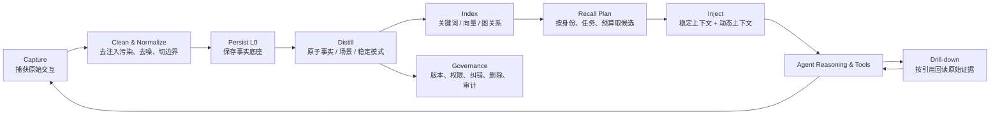
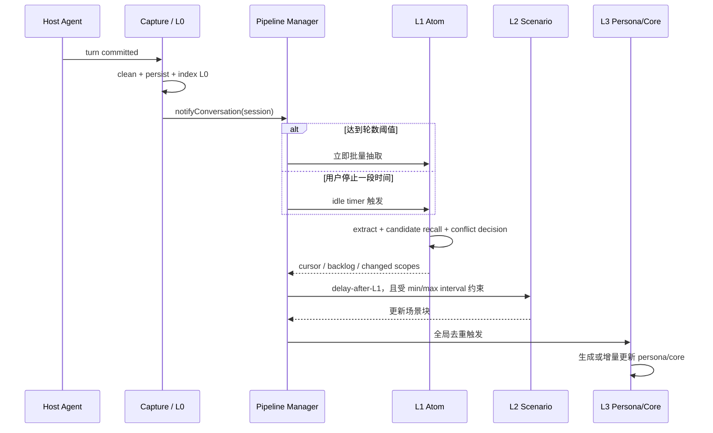
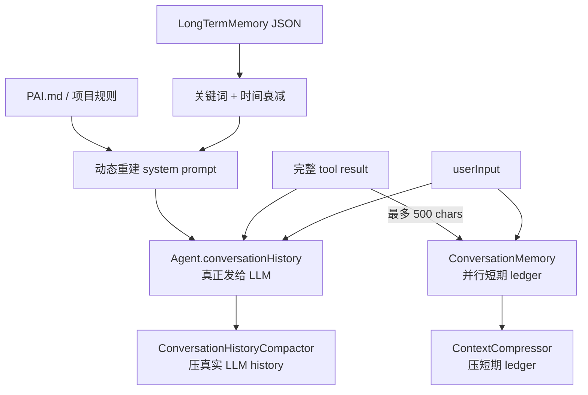

# TencentDB Agent Memory 工程剖析与 PaiCLI 对照报告

> 目标：不是规划 PaiCLI 的下一步，而是借两套真实实现理解 AI IDE / Coding Agent 的 memory 与 harness engineering，并把理解转化为更有效的使用方法。
>
> 分析日期：2026-08-13  
> 腾讯基线：`TencentDB-Agent-Memory v2.0.0`，发布于 2026-08-03，commit `0aff21a`  
> PaiCLI 基线：当前工作区代码；仅做只读审计，未修改实现  
> 证据原则：代码行为优先于 README；官方自报 benchmark 不等同于独立验证结果。

## 阅读方式

- **5 分钟**：读第一、二、十一、十七节，掌握结论与 PaiCLI 判断。
- **30 分钟**：再读第四至十节，理解腾讯的捕获、分层、召回、卸载和隔离。
- **用于 AI IDE**：直接读第十四、十五节，并照着第十五节的提示词实践。
- **源码学习**：按第十六节给出的文件顺序阅读，避免一开始陷入存储实现细节。

## 一、先读结论：真正值得学的不是“加一个向量库”

如果只记住三件事：

1. **Memory 不是数据库，而是一套“上下文编译系统”。** 它负责捕获、清洗、分层、索引、召回、注入、压缩、追溯和权限控制。存进去只是开始，能否在正确时机把正确证据以正确预算送进模型，才决定效果。
2. **长任务的关键不是生成一段更聪明的摘要，而是“摘要仍能指回原始证据”。** 腾讯的工具结果卸载保留 `result_ref`，场景和画像保留下钻路径；PaiCLI 当前的摘要压缩是不可逆替换，发生摘要遗漏后很难恢复。
3. **Harness engineering 的核心是把可靠性放到模型外。** 项目文档、代码、测试、计划、工具输出、权限、日志和评测都要成为 Agent 可读取、可验证的环境。Memory 只是其中一层，不能代替代码与测试这类事实源。

一句话评价腾讯方案：

> 它把“聊天记忆”扩展成了一个可移植的 Agent 经验资产平台，并在最难的几个地方——来源保留、分层抽象、动态/稳定注入、主动下钻、长任务卸载、隔离与治理——给出了相当具体的工程答案。

一句话评价 PaiCLI 当前方案：

> 它是一套适合单用户、本地 CLI、显式保存偏好的轻量 memory；项目级 `PAI.md` 很符合 harness engineering，但短期记忆存在双状态源，长期召回与证据链较弱，尚不是“可自我沉淀、可追溯、可多 Agent 装配”的完整 memory engine。

## 二、先建立正确心智模型

### 2.1 模型本身并没有跨请求记忆

一次 LLM 请求能“记得”什么，取决于宿主在这一轮实际提交了什么：

```text
本轮模型输入
= system / developer 指令
+ 当前保留的 conversation history
+ 项目规则与文档片段
+ 自动召回的长期记忆
+ Agent 主动调用工具取回的证据
+ 当前用户消息
+ 工具定义
```

所以研究一个 AI IDE 的 memory，首先不要看名为 `MemoryManager` 的类，而要追踪：

> **最终调用模型 API 的 messages 是在哪里组装的？哪些内容真的进入了它？**

这条原则直接揭示了 PaiCLI 最重要的历史问题：真正发给模型的是 `Agent.conversationHistory`，而不是 `ConversationMemory`。后者曾被当成“主上下文”，但实际只是并行记录；项目后来不得不增加 `ConversationHistoryCompactor`，源码注释也明确承认了这一错位。

### 2.2 Memory 的完整闭环



缺少任何一段都会产生典型故障：

| 缺少环节 | 典型表现 |
| --- | --- |
| 原始持久化 | 摘要错了以后无法核对原话 |
| 清洗 | 系统把自己注入的旧记忆再次当作用户新事实，形成记忆回音 |
| 分层 | 所有历史都平铺检索，相关性与上下文预算越来越差 |
| 冲突处理 | 用户的新偏好与旧偏好同时存在，模型随机选一个 |
| 预算 | 召回越多，当前任务反而越难做 |
| 主动下钻 | 自动召回没命中后，模型没有补救手段 |
| 权限 | 多用户或多 Agent 场景发生串记忆 |
| 评测 | “感觉它记得更多”掩盖了错误召回和 token 膨胀 |

## 三、腾讯 v2.0.0 的总体架构

腾讯把产品扩成了四类 Memory Asset：Chat Memory、Skill、Wiki、CodeGraph，再通过 Memory Hub 管理 Owner、版本、状态、可见性和 Agent Loadout，通过 Memory Proxy 接入 Claude Code 等 Agent。v2.0.0 的发布说明可见[官方 Release](https://github.com/TencentCloud/TencentDB-Agent-Memory/releases/tag/v2.0.0)，产品结构可见[固定版本 README_CN](https://github.com/TencentCloud/TencentDB-Agent-Memory/blob/v2.0.0/README_CN.md)。

需要把两个维度分开理解：

- **Chat Memory 的 L0–L3**：跨会话长期记忆的语义金字塔。
- **Context Offload 的 L1/L1.5/L2/L3**：当前长任务里工具日志的卸载和上下文压缩流水线。

两边都使用 L1/L2/L3 命名，很容易误以为是同一条管线。它们解决的是不同问题：前者回答“以后应记住什么”，后者回答“当前窗口快满时如何继续工作”。

### 3.1 长期记忆金字塔

| 层 | 内容 | 更新速度 | 主要用途 | 可信度角色 |
| --- | --- | --- | --- | --- |
| L0 Conversation | 原始 user/assistant 对话及上下文 | 每轮 | 核对原话、时间、来源 | 证据层 |
| L1 Atom | 事实、偏好、约束、事件、工作事实/方法等原子条目 | 较快 | 精确检索与注入 | 检索层 |
| L2 Scenario | 围绕场景或项目组织的 Markdown 知识块 | 延迟聚合 | 快速恢复工作场景 | 导航/情境层 |
| L3 Core / Persona | 长期画像、稳定模式、团队工作原则 | 最慢 | 冷启动和稳定语境 | 高密度先验层 |

关键不是“四层听起来高级”，而是信息从上往下越来越抽象、从下往上越来越可验证：

```text
L3 高层结论
  ↓ 找相关场景
L2 场景块
  ↓ 找原子事实
L1 Atom
  ↓ 找原话
L0 Conversation
```

官方文档将这种能力称为“白盒可溯源”。从源码看，L1 至少保存 `source_message_ids`、session、时间轨迹和版本；L2/L3 通过场景导航与文件读取下钻。不过需要客观看：v2.0.0 的不同资产和层级在来源粒度上并非完全一致，不能理解成每句 L3 文本都已经具备形式化 proof graph。

### 3.2 宿主无关的核心边界

[`TdaiCore`](https://github.com/TencentCloud/TencentDB-Agent-Memory/blob/v2.0.0/MemoryCore/src/core/tdai-core.ts) 对宿主暴露几个关键语义接口：

```text
handleBeforeRecall(userText, sessionKey)  // 模型调用前召回
handleTurnCommitted(completedTurn)        // 一轮完成后捕获
searchMemories(...)                       // Agent 主动搜 L1
searchConversations(...)                  // Agent 主动搜 L0
handleSessionEnd(sessionKey)              // 只 flush 一个 session
destroy()                                 // 整个进程/实例关闭
```

这是很值得学习的“深模块”边界：Memory Core 不需要知道宿主叫 OpenClaw、Hermes 还是 Claude Code，只需要宿主能在正确生命周期点提供原始用户文本、完成后的消息和 session identity。

对 AI IDE 来说，这个设计比某个向量数据库选择重要得多。适配失败通常不是搜索算法失败，而是没有稳定拿到：

- prompt 构建前的原始用户消息；
- 本轮开始前的消息位置；
- 本轮完成后的完整消息；
- session / user / agent / team 身份；
- session 结束和进程退出两个不同事件。

源码甚至记录了一个真实并发故障：旧实现曾在单 session 结束时销毁整个 scheduler，连带清除其他 session 的状态。v2.0.0 已把 `flushSession` 与全局 `destroy` 分开。这种生命周期语义是服务化 memory 必须处理、但本地 demo 常忽略的部分。

## 四、关键技术一：捕获必须避免“记忆自我污染”

这是本次源码阅读里最值得记住的具体技巧。

### 4.1 污染是如何发生的

很多 Agent 框架会在用户原始问题前拼入召回结果：

```text
<relevant-memories>
用户偏好 Java 17……
</relevant-memories>

用户原话：为什么这个测试失败？
```

如果一轮结束后，memory 插件直接把框架中的 user message 写回 L0，它记录到的就不是用户原话，而是“旧记忆 + 用户原话”。下一次抽取时，LLM 可能把注入内容再次提取为新事实；多轮之后，错误会自我复制并获得虚假的“多次出现”权重。

### 4.2 腾讯的处理

[`l0-recorder.ts`](https://github.com/TencentCloud/TencentDB-Agent-Memory/blob/v2.0.0/MemoryCore/src/core/conversation/l0-recorder.ts) 的做法是：

1. 在 `before_prompt_build` 时缓存干净的 `originalUserText` 和当时的 message count。
2. 一轮完成后，优先按位置切片，只处理本轮新增消息；timestamp cursor 作为进程重启等情况下的回退。
3. 找到被 `prependContext` 污染的 user message，用缓存的原始文本替换。
4. 再执行清洗、过滤和 L0 持久化。

这是典型的 harness 思维：不要提示模型“请不要重复记忆”，而是在消息边界保存干净事实，并通过确定性的工程逻辑恢复它。

PaiCLI 在这一点上反而较安全：`Agent.run()` 先把原始 `userInput` 写进 `MemoryManager`，召回只用于更新 system prompt，短期 ledger 没有直接捕获注入后的 user message。但它也说明了一个普遍规则：**捕获链与注入链必须明确分开，不能从已经组装完成的 prompt 反推用户原话。**

## 五、关键技术二：异步分层不是“定时总结”，而是状态机

腾讯的 [`MemoryPipelineManager`](https://github.com/TencentCloud/TencentDB-Agent-Memory/blob/v2.0.0/MemoryCore/src/utils/pipeline-manager.ts) 管理每个 session 的计数、游标、timer、retry、queue 和 checkpoint。



几个有工程含量的细节：

- **冷启动 warm-up**：新 session 的 L1 阈值从 1 开始，按 `1 → 2 → 4 → … → steady state` 增长。第一次使用能较快产生记忆，稳定期再降低提取频率和成本。
- **双触发**：达到对话轮数阈值立即跑；没达到时用 idle debounce 收尾，避免少量对话永远不沉淀。
- **数据库游标是事实源**：新实现即使内存 buffer 为空，L1 runner 也会按 L0 cursor 查数据库，能够恢复进程中断后的 backlog。
- **失败不推进状态**：L1 失败会把 buffer 放回，最多自动重试 5 次；之后保留工作，等下一轮用户活动再恢复。
- **L2 限频**：`delayAfterL1` 控制新记忆后的及时性，`minInterval` 防止频繁生成，`maxInterval` 保证活跃 session 最终会聚合。
- **冷 session 停止 timer**：避免后台持续为早已结束的用户生成 L2/L3。
- **按 session flush**：会话结束只收尾该 session，全局关闭才销毁共享资源。

这揭示了自动记忆的真实成本：一旦允许自动沉淀，就必须接受 eventual consistency，并处理重复任务、乱序、失败恢复、积压、冷启动和关闭语义。它不再是一个 `save(fact)` 方法，而是后台数据产品。

## 六、关键技术三：L1 既要抽取，也要解决冲突

腾讯的 L1 数据模型可见 [`l1-writer.ts`](https://github.com/TencentCloud/TencentDB-Agent-Memory/blob/v2.0.0/MemoryCore/src/core/record/l1-writer.ts)：

```text
id, content, type, priority, scene_name,
source_message_ids, metadata, timestamps,
createdAt, updatedAt, version,
teamId, userId, agentId, sessionId, taskId
```

聊天模式有 persona / episodic / instruction；工作模式又增加 work_fact / work_task / work_method / work_artifact。这比只有 `content + type + metadata` 更适合处理“事实会变化”这一现实。

### 6.1 冲突处理链

[`l1-dedup.ts`](https://github.com/TencentCloud/TencentDB-Agent-Memory/blob/v2.0.0/MemoryCore/src/core/record/l1-dedup.ts) 不是对所有历史做 O(N) 比较，而是：

1. 为每条新记忆检索 top-K 相似旧记录；
2. 优先用向量候选，退化到 FTS5；
3. 把新记录和候选成批交给 LLM；
4. LLM 对每条给出 `store / update / merge / skip`；
5. update/merge 会提升 version，并保留合并后的时间轨迹。

### 6.2 这里的取舍

优点：

- 不把“去重”和“字符完全相同”混为一谈；
- 能处理“以前用 Python，现在改用 Java”这种语义更新；
- 冲突候选受 isolation filter 限制，不跨租户去重；
- 成批判断比每条一次 LLM 调用更便宜。

风险：

- 冲突判断本身由 LLM 完成，可能错误 merge 或 update；
- 没有搜索能力、LLM 失败或输出解析失败时，策略倾向 `store all`，即优先不丢数据，但会牺牲记忆整洁度；
- RRF 或向量召回漏掉真正冲突项时，后面的 LLM 根本看不到它；
- 自动抽取会把 assistant 的错误也带进候选，来源角色和事实确认机制仍然重要。

这说明“自动记忆”不能只统计成功写入数，还应监控冲突决策分布、重复率、纠错率和来源质量。

## 七、关键技术四：召回是“两阶段”，不是一次 top-K

腾讯同时提供：

- **主动注入（proactive recall）**：每轮 prompt 构建前自动执行；
- **Agent 工具召回（active/tool recall）**：模型发现自动注入不足时，主动调用 `tdai_memory_search` 或 `tdai_conversation_search`。

### 7.1 自动召回

[`auto-recall.ts`](https://github.com/TencentCloud/TencentDB-Agent-Memory/blob/v2.0.0/MemoryCore/src/core/hooks/auto-recall.ts) 会：

1. 清洗 gateway 元数据、媒体标记和 base64 等噪音；
2. 搜索 L1；
3. 应用最大条数、单条字符、总字符和总超时预算；
4. 读取 L3 persona；
5. 生成 L2 scene navigation；
6. 把稳定内容和动态内容放到不同注入位置。

### 7.2 BM25 + 向量 + RRF

SQLite 路径并行执行 FTS5/BM25 与向量检索，各自多取候选，再用 Reciprocal Rank Fusion 合并：

```text
RRF(d) = Σ 1 / (k + rank_i(d) + 1),  k = 60
```

直觉是：

- BM25 擅长精确名词、错误码、类名、版本号；
- 向量擅长同义改写和语义近似；
- RRF 不要求两种分数处于同一量纲，只融合排名；
- 同一条记录同时在两张榜靠前，会得到更高总分。

TCVDB 如果支持原生 hybrid，就走单请求，避免重复 embedding 和网络往返。相关工具实现见 [`memory-search.ts`](https://github.com/TencentCloud/TencentDB-Agent-Memory/blob/v2.0.0/MemoryCore/src/core/tools/memory-search.ts) 与 [`conversation-search.ts`](https://github.com/TencentCloud/TencentDB-Agent-Memory/blob/v2.0.0/MemoryCore/src/core/tools/conversation-search.ts)。

RRF 的边界也要看清：它只相信名次，不利用绝对分数校准；没有 cross-encoder reranker；候选质量差时，融合不会凭空创造正确结果。

### 7.3 自动召回失败后为什么还要给模型搜索工具

自动 top-K 的目标是低延迟、小预算，不可能覆盖所有历史。腾讯在 prompt 中明确告诉主 Agent：

- 需要事实、偏好和规则时搜 L1；
- 需要原话、时间线和上下文时搜 L0；
- 已定位场景但需要完整过程时读 scene 文件；
- 每轮 memory search 与 conversation search 合计最多 3 次。

这个设计把一次不可逆的“召回决定”变成可恢复流程：

```text
便宜的自动召回
  → 信息够：直接工作
  → 信息不够：Agent 主动搜 L1
  → 需要原文验证：再搜 L0 / 读文件
```

PaiCLI 当前只有自动关键词注入和 CLI 人工 `/memory search`，没有 Agent 可调用的 `memory_search` / `conversation_search`。因此一次自动召回没命中后，模型自己无法补救。

## 八、关键技术五：稳定上下文和动态上下文分开注入

腾讯把召回结果拆成：

- `appendSystemContext`：L3 persona、L2 scene navigation、memory tools guide；变化较慢；
- `prependContext`：与本轮问题相关的 L1 条目；每轮变化。

目的是减少动态 L1 对 system prompt cache 的破坏。即使不考虑缓存，这种分离也有认知价值：

```text
稳定层：你是谁、团队长期原则、有哪些场景、如何下钻
动态层：这次问题最相关的几条事实
当前层：用户此刻真正要做什么
```

需要保留一个技术保留意见：prompt cache 的实际命中取决于模型供应商的前缀缓存规则、宿主如何拼接 system blocks，以及更早的系统内容是否稳定。“放到 system prompt 尾部”不自动等于缓存一定最优，必须看真实 cache token 指标。

PaiCLI 每轮把检索结果放回 system prompt，并整体替换 `conversationHistory[0]`。功能上成立，但动态记忆与稳定项目规则没有形成缓存/语义边界。

## 九、关键技术六：符号化短期记忆与可恢复卸载

Coding Agent 最容易撑爆上下文的通常不是聊天，而是工具结果：大文件、测试日志、搜索结果、网页、编译错误和 diff。腾讯的 Context Offload 采用“两平面”设计：

```text
热上下文平面：短摘要 + Mermaid 任务画布 + node_id
冷证据平面：refs/*.md 中的完整工具结果
```

[`OffloadEntry`](https://github.com/TencentCloud/TencentDB-Agent-Memory/blob/v2.0.0/MemoryCore/src/offload/types.ts) 的关键字段：

```text
tool_call_id  // 对应原始工具调用
node_id       // L2 分配的任务图节点
summary       // LLM 生成的短摘要
result_ref    // 完整原始结果的文件路径
score         // 摘要替代原文的安全程度
```

处理过程大致是：

1. 捕获 tool call/result pair；
2. 先把完整结果写入 `refs/*.md`；
3. L1 为结果生成摘要与 replaceability score；失败重试后也会生成本地 fallback 摘要，但原文引用仍保留；
4. L1.5 判断任务是否完成、是否续接旧任务、是否值得建长期任务画布；
5. L2 把工具步骤组织为 Mermaid MMD，绑定 node；
6. 上下文升高时，L3 先温和替换非当前任务/高可替代结果，再激进删除旧消息；
7. 被替换的 tool result 变成：摘要 + `node_id` + `result_ref`，模型需要时可重新读原文。

[`l3-helpers.ts`](https://github.com/TencentCloud/TencentDB-Agent-Memory/blob/v2.0.0/MemoryCore/src/offload/l3-helpers.ts) 中的替换文本明确告诉模型：`read this file for full tool call and raw result`。这比“把 100 KB 日志总结成三句话，然后删除原文”可靠得多。

### 9.1 分级压力策略

默认配置表现出一套分级控制思想：

- mild：大约 50% 上下文时，优先把可替代 tool result 换成摘要；
- aggressive：大约 85% 时，按边界删除更老的消息，并用任务画布接管状态；
- emergency：大约 95% 时，快速压到更安全目标；
- active MMD 自身也有 token 比例上限，避免“摘要索引”反过来占满窗口。

源码还保护 tool_call / tool_result 配对边界，MMD 注入点不能插进协议对之间。对支持严格 tool-call history 的 API，这是正确性约束，不只是排版细节。

### 9.2 Mermaid 的真实作用

Mermaid 不是魔法推理格式。它的价值主要在于：

- 强迫任务状态具有节点和边；
- 给大量工具结果一个稳定 node id；
- 用较少文本表达依赖、已完成/进行中/待办；
- 人和 Agent 都能阅读；
- 可以从节点回到 raw result。

它也可能脆弱：LLM 生成的节点映射可能错、图可能过度抽象，复杂并行状态未必适合 Mermaid。真正保证可恢复性的不是图，而是 `tool_call_id → node_id → result_ref` 这条引用链。

## 十、关键技术七：隔离、资产化与 Agent Loadout

单人 CLI 的 memory 可以只有 `project/global`；团队产品必须回答：

- 谁拥有这条记忆？
- 哪个 Agent 能看？
- 能否跨 session 聚合？
- 何时分享给 team？
- 哪个版本有效？
- 能否撤销或删除？

腾讯 v2.0.0 在 Memory Hub 中把 Chat Memory、Skill、Wiki、CodeGraph 统一成资产，支持 `private / team / restricted / agent` 可见性与定向装配。发布说明明确强调新 Chat Memory 与 Skill 默认私有，分享是显式动作。

Memory Core 的严格 v3 数据面要求 team + agent + user；session 可选用于查询收敛，L0/L1 写入仍携带 session 维度。源码见 [`isolation.ts`](https://github.com/TencentCloud/TencentDB-Agent-Memory/blob/v2.0.0/MemoryCore/src/core/store/isolation.ts) 和 [`v2-router.ts`](https://github.com/TencentCloud/TencentDB-Agent-Memory/blob/v2.0.0/MemoryCore/src/gateway/v2-router.ts)。检索过滤尽量下推到存储，取回后还有 `rowMatchesIsolation` 复核，防止旧后端无法完整下推条件。

对 AI IDE 的启示不是“个人也要上 ACL”，而是：**记忆必须有明确作用域。** 至少要区分：

```text
用户全局偏好 ≠ 当前仓库规则 ≠ 当前任务临时状态 ≠ 某个 Agent 的私有经验
```

混在一起后，“记忆越多”通常意味着“上下文污染越重”。Loadout 的本质就是在召回前先按身份和职责缩小可见资产集合。

## 十一、PaiCLI 当前 memory 的客观审计

### 11.1 实际数据流



证据入口：

- [`Agent.java`](../src/main/java/com/paicli/agent/Agent.java)：实际维护并提交 `conversationHistory`，每轮检索长期记忆并重建 system prompt。
- [`MemoryManager.java`](../src/main/java/com/paicli/memory/MemoryManager.java)：记录短期 ledger、显式长期事实、token 状态和另一套压缩。
- [`ConversationHistoryCompactor.java`](../src/main/java/com/paicli/memory/ConversationHistoryCompactor.java)：压缩真正发给 LLM 的历史。
- [`ContextCompressor.java`](../src/main/java/com/paicli/memory/ContextCompressor.java)：压缩 `ConversationMemory`。
- [`LongTermMemory.java`](../src/main/java/com/paicli/memory/LongTermMemory.java)：单 JSON 文件持久化。
- [`MemoryRetriever.java`](../src/main/java/com/paicli/memory/MemoryRetriever.java)：关键词与时间衰减召回。

### 11.2 做得好的地方

1. **长期记忆默认显式保存。** `/save` 或用户明确要求才保存，避免自动抽取把误解永久化。对本地 coding agent，这是一个很合理的安全取舍。
2. **项目规则与个人记忆分开。** `PAI.md` 是仓库级、可版本化、团队共享的稳定规则；LongTermMemory 保存个人或项目作用域事实。这比把一切塞进一个向量库更符合 harness engineering。
3. **真实 history 已有独立压缩补丁。** 能识别 user 边界，避免切断 tool-call/result 对；自动和手动压缩保留最近轮次。
4. **有基本治理命令。** list/search/delete/clear 让长期记忆可观察、可删除，而不是隐藏黑箱。
5. **召回只自动注入长期事实。** 当前 user 输入和短期 history 不会重复以“相关记忆”身份再注入，避免模型把当前请求误判为历史事实。
6. **实现简单、可读、部署成本低。** 对单用户本地 CLI，小系统比完整服务更容易理解和维护。

### 11.3 结构性问题

#### A. 两套短期状态源

`ConversationMemory` 的类注释说自己“维护对话历史”，但模型实际使用 `conversationHistory`。两者：

- 写入时机不同；
- tool result 一个完整、一个截断 500 字符；
- token 估算不同；
- 压缩算法不同；
- 摘要结果彼此不回写；
- 状态栏看到的 short-term memory 不等同于下一轮真实上下文。

这会产生典型的 shadow state：系统以为自己压缩了，模型输入其实没有变。`ConversationHistoryCompactor` 修复了 window 溢出的直接问题，但没有消除双状态语义。

#### B. 摘要是不可逆替换

`ConversationHistoryCompactor` 把旧 history 交给 LLM 生成 1–3 段摘要，然后用摘要替换原消息。其输入最多拼 60,000 字符，超过后直接截断；没有：

- 原始 history 的持久化引用；
- 摘要句到原消息/tool result 的 evidence link；
- 关键文件、命令、测试结果的结构化 task state；
- 摘要质量检查或“摘要必须比原文更短”的保护；
- 丢失后由 Agent 主动下钻恢复的工具。

因此它是“有边界保护的 lossy summarization”，不是可恢复 offload。

#### C. 长期记忆是扁平 JSON 事实表

当前实现：

- `ConcurrentHashMap` 存内存；
- 每次 store/delete/clear 重写整个 `long_term_memory.json`；
- 只对 content 完全相同做去重；
- 旧记录缺 scope 时按 global 处理；
- 没有 source message、置信度、版本、valid time、supersedes/conflicts；
- 没有原子写替换或跨进程锁语义；
- `/memory search` 按当前项目过滤，但 `/memory list` 与 `/memory clear` 面向整个文件，作用域 UX 不完全一致。

对少量个人事实足够，对自动增长、多进程或团队共享并不够。

#### D. 检索属于启发式关键词召回

`MemoryRetriever` 使用分词、substring 匹配和 24 小时时间衰减，长期记忆额外乘 1.2。优点是便宜透明，局限是：

- 类名、错误码等精确词可能工作不错；
- 同义表达和跨语言改写容易漏；
- 没有 BM25 的词频/逆文档频率；
- 没有向量候选、融合或 reranker；
- 没有可解释 threshold 与召回质量指标；
- 没有 Agent 主动搜索 L0 的补救路径。

#### E. 三条执行路径的 memory 语义不一致

- ReAct：按用户输入召回长期记忆。
- Plan-and-Execute：按每个 task description 召回。
- Multi-Agent：Orchestrator 只记录总输入/输出；SubAgent 的 system prompt 加载 `PAI.md`，但没有按任务注入 LongTermMemory。

这意味着同一用户问题换一种执行模式，Agent 看到的个人长期事实可能不同。共享 `MemoryManager` 不等于每个 worker 的 prompt 真正包含相关记忆。

#### F. 自动事实抽取代码存在，但没有进入主链

`ContextCompressor.extractFacts()` 可以从对话抽取并写长期记忆，但当前主代码没有调用它。这与项目“只显式保存长期记忆”的规则一致，属于安全的未接线状态。需要注意：如果未来误接入，该方法写入的 metadata 没有 scope，而 `LongTermMemory` 会把缺失 scope 当 global，可能产生跨项目污染。

### 11.4 审计评分

以下不是学术 benchmark，而是基于当前代码的工程成熟度量表：

| 维度 | 评分 | 判断 |
| --- | ---: | --- |
| 单用户本地 CLI 适配度 | 7/10 | 简单、显式、低依赖，够用 |
| 项目知识 / harness 对齐 | 8/10 | `PAI.md`、代码搜索、测试等方向正确 |
| 真实上下文一致性 | 5/10 | 真 history 已能压缩，但双状态仍在 |
| 长期记忆质量 | 4/10 | 显式事实安全，但模型、冲突与来源信息有限 |
| 召回能力 | 3/10 | 关键词启发式，无主动 L0/L1 下钻 |
| 长任务连续性 | 4/10 | 有摘要压缩，无可恢复 evidence offload |
| 可审计/纠错 | 5/10 | 可列出删除；缺来源、版本、冲突链 |
| 多 Agent / 多租户 | 3/10 | project/global 作用域，执行路径语义不齐 |
| 可观测性与质量评测 | 4/10 | 有 token/状态和单测，缺 memory 质量 benchmark |
| 简洁与可理解性 | 8/10 | 代码小而直观，学习价值高 |

综合判断：

- **作为个人本地 CLI memory：约 6/10，实用但有明显边界。**
- **作为腾讯所定义的团队级 Agent Memory 平台：约 3–4/10，不是同一产品阶段。**

这不是贬低。PaiCLI 选择“少自动化、低复杂度”的同时，也避免了自动抽取的错误放大、后台 eventual consistency、权限和服务运维成本。腾讯更强，但复杂度不是免费的。

## 十二、逐项对照

| 问题 | PaiCLI | TencentDB Agent Memory v2.0.0 | 学习结论 |
| --- | --- | --- | --- |
| 实际 LLM 上下文 | `conversationHistory` | Host hook + Core 返回注入片段 | 先找真正的 messages assembly |
| 原始事实层 | 当前 session history，未做长期 L0 搜索库 | L0 持久化、FTS/向量可搜 | 摘要之外必须保留事实底座 |
| 长期事实 | 用户显式 `/save` | L1 自动抽取 + 冲突处理 | 自动化换来质量治理成本 |
| 场景恢复 | `PAI.md` 人工维护项目规则 | L2 自动场景块 + navigation | 稳定项目知识适合 repo；交互经验可异步聚合 |
| 高层画像 | 无独立层 | L3 persona / core | 高层先验必须低频、限长、可回溯 |
| 检索 | 分词 + substring + time decay | BM25 + vector + RRF | 精确词与语义词互补 |
| 召回模式 | 自动注入；人工 CLI search | 自动注入 + Agent 搜 L1/L0/文件 | top-K 失败后要有恢复通道 |
| 注入位置 | 动态重建 system prompt | 稳定 system + 动态 user prefix | 稳定/动态分区降低噪声和 cache churn |
| 长上下文 | 两套 lossy summary | raw refs + summaries + MMD + 分级压缩 | 最重要的是索引和证据引用 |
| 冲突/版本 | exact content dedup | store/update/merge/skip + version | 记忆会变化，必须表示变化 |
| 作用域 | project/global | team/user/agent/session/task + ACL/loadout | 先缩小权限集合，再做相关性召回 |
| 多 Agent | 共享 manager，但 worker 注入不完整 | Agent Loadout 定向装配 | 共享存储不等于共享正确上下文 |
| 存储 | 单 JSON 文件 | SQLite + sqlite-vec / TCVDB + 文件 | 后端是结果，不是架构起点 |
| 可观测性 | 状态/token/日志/单测 | trace、pipeline、recall、dedup、token metrics | memory 要评估整条链，不只测 CRUD |

## 十三、腾讯方案也有哪些不足与未证实之处

### 13.1 自动抽取会放大错误

L0 是用户和 assistant 的对话，不天然都是真相。若 assistant 曾经误判项目事实，L1 extractor 可能把它变成稳定条目，L2/L3 再继续抽象，错误会获得更高权威感。来源链接能帮助纠错，但不能自动证明内容正确。

对 coding agent，可靠性优先级应是：

```text
当前代码与测试
  > 版本化设计文档 / 已批准决策
  > 有来源的原子记忆
  > 场景与 persona 摘要
  > 模型根据旧对话的推断
```

### 13.2 最终一致性带来“刚说过却还没记住”

L1/L2/L3 是异步流水线。官方 SDK demo 甚至为沉淀预留等待时间。用户刚表达的新偏好，下一轮是否进入哪个层，取决于捕获、阈值、idle timer 和后台任务状态。产品必须向用户解释“当前 session history”和“已持久化长期记忆”不是一回事。

### 13.3 默认配置存在需要验证的张力

固定版本源码中 recall strategy 默认值是 `hybrid`，embedding provider 默认 `none`；`auto-recall` 对缺失 embedding 的 hybrid 配置有 structured error / fast-fail 逻辑，而 README 又称零配置使用 BM25。这可能由外层配置归一化、不同接入模式或近期演进来解释，但从代码阅读角度，它是一个应通过集成测试确认的边界，而不是仅凭文档相信。

### 13.4 隔离代码有演进痕迹

`isolation.ts` 注释描述强制缺字段时抛错，但 helper 本身会填默认 bucket；真正的 v3 严格 422 校验主要在 Gateway router。v2/v3 兼容路径、默认 bucket 和 strict 模式并存，提高了迁移能力，也提高了误配复杂度。

### 13.5 公开 benchmark 覆盖不足

v2.0.0 README 当前公开表格只列 PersonaMem：48% → 76%。这是官方自报结果，能说明用户信息记忆方向，但不能单独证明：

- Coding Agent 长任务一定更成功；
- token 下降一定来自 memory 而非其他 harness 差异；
- Wiki / CodeGraph / Skill / Loadout 的组合收益；
- 错误召回率、隐私串扰率和长期陈旧率；
- 不同模型、不同 context window 下的稳定收益。

理想评测应同时测：任务成功率、token、延迟、召回 precision/recall、错误记忆采纳率、冲突修正率、来源下钻成功率和隔离泄漏为零。

### 13.6 系统复杂度很高

Memory Core、Knowledge、Hub、Proxy、SQLite/TCVDB、对象存储、后台 pipeline、LLM extraction、embedding、ACL 和多个 adapter 组成完整平台。对团队产品合理，对个人本地 IDE 可能是明显过度设计。技术学习时应提取原则，不必照搬部署拓扑。

## 十四、这对 harness engineering 意味着什么

OpenAI 的 [Harness engineering](https://openai.com/index/harness-engineering/) 强调：仓库知识应成为 system of record，短 `AGENTS.md` 充当地图，深层文档按需读取；日志、指标、测试和工具要对 Agent 可见并可执行。

腾讯 memory 与这一思路是互补而不是替代关系：

```text
Repository harness
  管“现在什么是真的”：代码、测试、规则、架构、计划、验证

Agent memory
  管“过去什么值得复用”：偏好、决策、事件、场景、工作方法、原始交互
```

两者冲突时，应该由事实源优先级解决，而不是让“更像人的长期记忆”覆盖仓库当前行为。

PaiCLI 的 `AGENTS.md + PAI.md + docs/ + 实时代码搜索` 已经具有 harness 的骨架。其最有价值的学习样本恰好不是 LongTermMemory，而是：

- `AGENTS.md` 作为导航和硬约束；
- 代码行为优先于路线图；
- Agent 能自己 grep/read/test，而不是把所有知识预注入；
- 项目稳定规则和个人偏好分开；
- 压缩前识别真实模型输入；
- 多执行路径共享工具与策略层。

## 十五、如何因此更好地使用任何 AI IDE

### 15.1 把上下文分成五类，别都塞进聊天

| 信息 | 最佳载体 | 原因 |
| --- | --- | --- |
| 长期项目规则、命令、架构边界 | 仓库内 `AGENTS.md` / docs | 可版本化、可 review、全团队共享 |
| 当前任务目标、进度、决策、验证 | task plan / handoff 文档 | 可跨压缩和跨 session 恢复 |
| 用户个人稳定偏好 | IDE 的显式 memory | 跨项目或跨会话复用 |
| 一次性指令 | 当前 prompt | 不应污染长期记忆 |
| 大型日志、搜索结果、网页、测试输出 | 文件/工件 + 摘要引用 | 节省 token，同时可回读原文 |

### 15.2 开始任务时，让 Agent 先建立“事实地图”

可直接使用：

```text
先读取仓库入口规则和与本任务直接相关的代码。请明确：
1. 最终真实执行路径；
2. 当前代码、文档、路线图有无冲突；
3. 你准备依赖哪些事实源。
引用具体文件；不确定的内容继续检索，不要用旧对话摘要补全。
```

这会迫使 Agent 区分 current code、项目记忆和推断。

### 15.3 长任务中，要求“状态画布 + 原始证据引用”

不要只说“记住我们做到哪了”，可以说：

```text
在上下文变长前维护一份任务状态：目标、约束、已完成步骤、当前步骤、
关键决策、修改文件、验证结果、未解决问题。大型工具结果只保留摘要，
但必须记录可回读的文件路径或命令来源。以后恢复时先读这份状态，再核对代码。
```

本质上是在人工要求 AI IDE 模拟腾讯的 `MMD + result_ref`，不依赖产品是否内置这一能力。

### 15.4 压缩后不要默认摘要正确

发现长对话被 compact 后，可以要求：

```text
先列出你从压缩摘要继承的：目标、约束、完成项、待办、关键文件和测试结果。
对任何会影响下一步修改的事实，重新读取代码/git diff/测试输出核验。
```

摘要适合导航，不适合充当最终证据。

### 15.5 记忆错了时，按来源层级纠错

```text
你刚才使用的结论可能来自旧记忆。请标出它来自：
项目规则、长期记忆、对话摘要、当前代码，还是你的推断。
然后以当前代码和测试为准重新核验；若长期记忆已过期，列出应删除或修正的条目。
```

如果 IDE 支持 memory list/delete，应显式清理错误条目；只在聊天中说“别再这样”通常不会修改持久化 memory。

### 15.6 一项任务一个 session，阶段变化时主动换线程

一个 session 同时包含架构讨论、bug 诊断、实现、另一个新需求，会让检索和压缩都难以识别边界。适合换 session 的信号：

- 目标已经从“理解”变成“实现”；
- 当前任务已经完成，开始无关任务；
- 摘要中充满失效决策；
- Agent 频繁引用旧文件或旧结论；
- 上下文很大，但真正相关信息很少。

换 session 前生成短 handoff，比在污染严重的历史上继续追加更可靠。

### 15.7 把验证闭环交给 Agent，而不是相信 memory

对 coding agent，最终应要求它读取并执行：

```text
代码 / schema / 配置
→ 编译与测试
→ git diff
→ 运行日志、指标或 UI 状态
→ 报告证据
```

Memory 能减少重复探索，但不能替代验证。真正高质量的 harness，是 Agent 能从环境得到及时、机器可判定的反馈。

### 15.8 控制自动注入，鼓励按需搜索

如果 IDE 可配置 memory：

- 稳定项目规则保持短小，只做地图；
- 默认召回少量高相关事实；
- 大文档和代码不要整库注入，给搜索/read 工具；
- 要求返回来源和时间；
- 旧偏好允许 supersede，而不是与新偏好并存；
- 多 Agent 时只给角色需要的资产，避免“全员全记忆”。

## 十六、30 分钟快速学习路径

### 0–5 分钟：理解核心抽象

重读本报告第二节。记住：

```text
memory = capture + distill + retrieve + inject + recover + govern
```

### 5–12 分钟：看腾讯主链

按顺序读：

1. [`tdai-core.ts`](https://github.com/TencentCloud/TencentDB-Agent-Memory/blob/v2.0.0/MemoryCore/src/core/tdai-core.ts)：宿主边界。
2. [`auto-capture.ts`](https://github.com/TencentCloud/TencentDB-Agent-Memory/blob/v2.0.0/MemoryCore/src/core/hooks/auto-capture.ts)：一轮完成后的捕获。
3. [`l0-recorder.ts`](https://github.com/TencentCloud/TencentDB-Agent-Memory/blob/v2.0.0/MemoryCore/src/core/conversation/l0-recorder.ts)：原始 prompt 去污染。
4. [`pipeline-manager.ts`](https://github.com/TencentCloud/TencentDB-Agent-Memory/blob/v2.0.0/MemoryCore/src/utils/pipeline-manager.ts)：异步状态机。

不要先读 SQLite 细节；先掌握生命周期。

### 12–18 分钟：看召回与压缩

1. [`auto-recall.ts`](https://github.com/TencentCloud/TencentDB-Agent-Memory/blob/v2.0.0/MemoryCore/src/core/hooks/auto-recall.ts)：分层召回、RRF、预算、注入位置。
2. [`memory-search.ts`](https://github.com/TencentCloud/TencentDB-Agent-Memory/blob/v2.0.0/MemoryCore/src/core/tools/memory-search.ts)：主动工具召回。
3. [`offload/types.ts`](https://github.com/TencentCloud/TencentDB-Agent-Memory/blob/v2.0.0/MemoryCore/src/offload/types.ts)：`node_id/result_ref`。
4. [`offload/l3-helpers.ts`](https://github.com/TencentCloud/TencentDB-Agent-Memory/blob/v2.0.0/MemoryCore/src/offload/l3-helpers.ts)：原文如何被可恢复摘要替换。

### 18–24 分钟：用 PaiCLI 看一个典型演进过程

1. [`Agent.java`](../src/main/java/com/paicli/agent/Agent.java)：找真实 messages。
2. [`MemoryManager.java`](../src/main/java/com/paicli/memory/MemoryManager.java)：看并行 ledger。
3. [`ConversationHistoryCompactor.java`](../src/main/java/com/paicli/memory/ConversationHistoryCompactor.java)：看为什么需要补丁。
4. [`MemoryRetriever.java`](../src/main/java/com/paicli/memory/MemoryRetriever.java)：看轻量召回的边界。
5. [`PAI.md`](../PAI.md) 与 [`AGENTS.md`](../AGENTS.md)：理解 repository memory 为什么通常比自动聊天记忆更可靠。

### 24–30 分钟：把知识用于自己的 AI IDE

练习三件事：

1. 给一个任务写“事实地图”提示词；
2. 让 Agent 生成带文件/测试引用的 task state；
3. 故意问一个旧结论，要求 Agent 区分长期记忆、摘要与当前代码，并重新核验。

能做好这三件事，通常比在设置里打开更多“自动 memory”更能提升实际稳定性。

## 十七、最后的判断

腾讯 v2.0.0 最值得学习的优先级：

1. **可恢复卸载：摘要必须指向 raw evidence。**
2. **捕获与注入分离，防止记忆回音污染。**
3. **L0–L3 分层：原始事实、原子条目、场景导航、稳定先验职责不同。**
4. **自动召回 + Agent 主动下钻的双阶段检索。**
5. **稳定与动态上下文分区，并受显式预算/超时控制。**
6. **把冲突、版本、来源、作用域、ACL 当作 memory 的一等属性。**
7. **用生命周期、队列、游标、retry 和 checkpoint 把自动沉淀做成可靠后台系统。**

不应盲目照搬的部分：

- 为个人本地工具部署完整 Hub/Proxy/Knowledge 服务；
- 因为“向量检索更高级”就丢掉精确搜索；
- 默认相信自动抽取的 persona 或团队原则；
- 用 Mermaid 替代真实任务状态和原始引用；
- 只看官方成功率，不测错误记忆、串扰、延迟和 token；
- 让 memory 覆盖当前代码与测试这个事实源。

对你现在“学习工具原理，从而更好使用 AI IDE”的目标，最有价值的转变是：

> 不再把 AI IDE 看成一个会自己记住一切的程序员，而是把它看成一个每轮都要由 harness 重新组装工作记忆的执行器。你提供清晰的事实源、任务边界、外部状态和验证闭环，它就稳定；你把希望寄托在一段越来越长的聊天历史上，它迟早会在压缩、污染或过期信息中漂移。

## 参考资料

### 腾讯官方

- [TencentDB Agent Memory v2.0.0 Release](https://github.com/TencentCloud/TencentDB-Agent-Memory/releases/tag/v2.0.0)
- [v2.0.0 README_CN](https://github.com/TencentCloud/TencentDB-Agent-Memory/blob/v2.0.0/README_CN.md)
- [腾讯云：Memory 介绍](https://cloud.tencent.com/document/product/1813/132100)
- [腾讯云：自研 Agent 接入指引](https://cloud.tencent.com/document/product/1813/132103)
- [v2.0.0 固定版本源码](https://github.com/TencentCloud/TencentDB-Agent-Memory/tree/v2.0.0)

### Harness engineering

- [OpenAI: Harness engineering — leveraging Codex in an agent-first world](https://openai.com/index/harness-engineering/)

### 本地 PaiCLI 证据

- [`memory/`](../src/main/java/com/paicli/memory/)
- [`Agent.java`](../src/main/java/com/paicli/agent/Agent.java)
- [`PlanExecuteAgent.java`](../src/main/java/com/paicli/agent/PlanExecuteAgent.java)
- [`AgentOrchestrator.java`](../src/main/java/com/paicli/agent/AgentOrchestrator.java)
- [`SubAgent.java`](../src/main/java/com/paicli/agent/SubAgent.java)
- [`ToolRegistry.java`](../src/main/java/com/paicli/tool/ToolRegistry.java)
- [`AGENTS.md`](../AGENTS.md)
- [`docs/agents-reference.md`](./agents-reference.md)

## 审计备注

本次针对 PaiCLI memory 的测试执行结果为 59 个测试中 58 个通过、1 个失败。失败位于 `MemoryManagerTest.shouldStoreProjectScopedFactsByDefault`，原因是测试使用 Unix 风格 `endsWith("/repo/current")` 断言 Windows 路径；它不是 memory 主链功能失败，但说明该测试存在跨平台假设。现有测试覆盖存储、作用域、检索和 compaction 机制，尚未形成长期记忆召回质量、错误记忆采纳率或长 session 任务成功率 benchmark。
